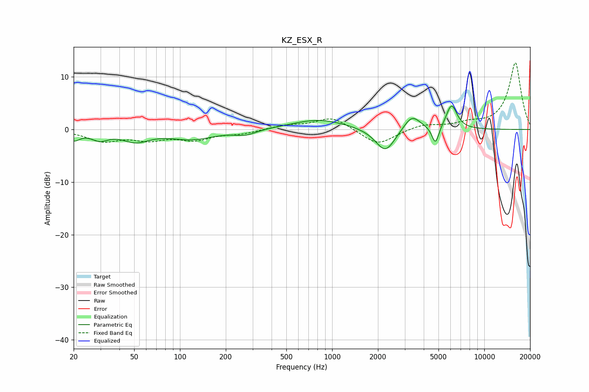

# KZ_ESX_R
See [usage instructions](https://github.com/jaakkopasanen/AutoEq#usage) for more options and info.

### Parametric EQs
Apply preamp of -4.6 dB when using parametric equalizer.

|   # | Type    |   Fc (Hz) |    Q |   Gain (dB) |
|-----|---------|-----------|------|-------------|
|   1 | Peaking |        20 | 3.5  |        -1.7 |
|   2 | Peaking |        30 | 2.61 |        -1.5 |
|   3 | Peaking |        51 | 1.6  |        -2   |
|   4 | Peaking |       120 | 0.97 |        -1.8 |
|   5 | Peaking |       270 | 2.11 |        -1   |
|   6 | Peaking |       820 | 0.8  |         1.9 |
|   7 | Peaking |      2239 | 2.18 |        -4.6 |
|   8 | Peaking |      3343 | 2.55 |         2.9 |
|   9 | Peaking |      4776 | 6    |        -3.5 |
|  10 | Peaking |      6094 | 3.82 |         4.7 |

### Fixed Band EQs
When using fixed band (also called graphic) equalizer, apply preamp of **-12.8 dB** (if available) and set gains manually with these parameters.

|   # | Type    |   Fc (Hz) |    Q |   Gain (dB) |
|-----|---------|-----------|------|-------------|
|   1 | Peaking |        31 | 1.41 |        -2.1 |
|   2 | Peaking |        62 | 1.41 |        -1.6 |
|   3 | Peaking |       125 | 1.41 |        -1.8 |
|   4 | Peaking |       250 | 1.41 |        -0.7 |
|   5 | Peaking |       500 | 1.41 |         0.7 |
|   6 | Peaking |      1000 | 1.41 |         2.4 |
|   7 | Peaking |      2000 | 1.41 |        -3.1 |
|   8 | Peaking |      4000 | 1.41 |         0.9 |
|   9 | Peaking |      8000 | 1.41 |         1   |
|  10 | Peaking |     16000 | 1.41 |        12.7 |

### Graphs

