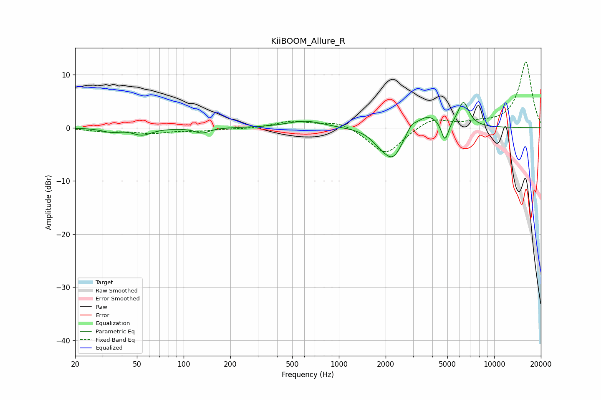

# KiiBOOM_Allure_R
See [usage instructions](https://github.com/jaakkopasanen/AutoEq#usage) for more options and info.

### Parametric EQs
Apply preamp of -4.9 dB when using parametric equalizer.

|   # | Type    |   Fc (Hz) |    Q |   Gain (dB) |
|-----|---------|-----------|------|-------------|
|   1 | Peaking |        34 | 2.5  |        -0.7 |
|   2 | Peaking |        54 | 2.35 |        -1.3 |
|   3 | Peaking |       131 | 3.19 |        -1   |
|   4 | Peaking |       610 | 1.21 |         1.3 |
|   5 | Peaking |      1821 | 2.69 |        -1.2 |
|   6 | Peaking |      2226 | 2.15 |        -5.7 |
|   7 | Peaking |      2930 | 4.95 |         1.2 |
|   8 | Peaking |      3721 | 1.66 |         2.8 |
|   9 | Peaking |      4817 | 5.95 |        -3.9 |
|  10 | Peaking |      6339 | 3.84 |         4.6 |

### Fixed Band EQs
When using fixed band (also called graphic) equalizer, apply preamp of **-12.5 dB** (if available) and set gains manually with these parameters.

|   # | Type    |   Fc (Hz) |    Q |   Gain (dB) |
|-----|---------|-----------|------|-------------|
|   1 | Peaking |        31 | 1.41 |        -0.6 |
|   2 | Peaking |        62 | 1.41 |        -0.9 |
|   3 | Peaking |       125 | 1.41 |        -0.5 |
|   4 | Peaking |       250 | 1.41 |        -0.2 |
|   5 | Peaking |       500 | 1.41 |         1.2 |
|   6 | Peaking |      1000 | 1.41 |         1.3 |
|   7 | Peaking |      2000 | 1.41 |        -5.2 |
|   8 | Peaking |      4000 | 1.41 |         1.9 |
|   9 | Peaking |      8000 | 1.41 |         0.7 |
|  10 | Peaking |     16000 | 1.41 |        12.4 |

### Graphs

