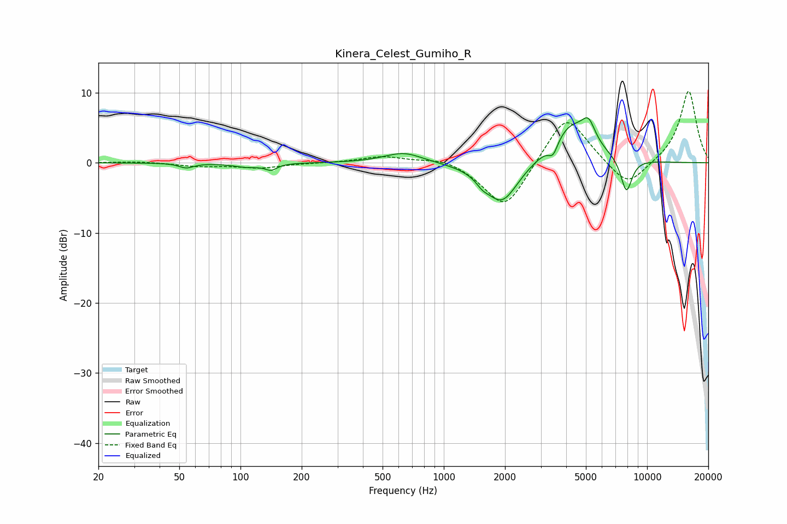

# Kinera_Celest_Gumiho_R
See [usage instructions](https://github.com/jaakkopasanen/AutoEq#usage) for more options and info.

### Parametric EQs
Apply preamp of -6.5 dB when using parametric equalizer.

|   # | Type    |   Fc (Hz) |    Q |   Gain (dB) |
|-----|---------|-----------|------|-------------|
|   1 | Peaking |        54 | 4.06 |        -0.7 |
|   2 | Peaking |       108 | 2.11 |        -0.6 |
|   3 | Peaking |       141 | 4.86 |        -0.8 |
|   4 | Peaking |       634 | 1.49 |         1.5 |
|   5 | Peaking |      1550 | 4.61 |        -0.8 |
|   6 | Peaking |      1929 | 1.73 |        -6   |
|   7 | Peaking |      3450 | 5.95 |        -2   |
|   8 | Peaking |      4246 | 1.36 |         5.7 |
|   9 | Peaking |      5155 | 4.42 |         2.7 |
|  10 | Peaking |      7910 | 4.65 |        -5   |

### Fixed Band EQs
When using fixed band (also called graphic) equalizer, apply preamp of **-10.3 dB** (if available) and set gains manually with these parameters.

|   # | Type    |   Fc (Hz) |    Q |   Gain (dB) |
|-----|---------|-----------|------|-------------|
|   1 | Peaking |        31 | 1.41 |         0.2 |
|   2 | Peaking |        62 | 1.41 |        -0.5 |
|   3 | Peaking |       125 | 1.41 |        -0.7 |
|   4 | Peaking |       250 | 1.41 |        -0   |
|   5 | Peaking |       500 | 1.41 |         0.9 |
|   6 | Peaking |      1000 | 1.41 |         0.9 |
|   7 | Peaking |      2000 | 1.41 |        -7   |
|   8 | Peaking |      4000 | 1.41 |         7.4 |
|   9 | Peaking |      8000 | 1.41 |        -3.8 |
|  10 | Peaking |     16000 | 1.41 |        10.4 |

### Graphs

