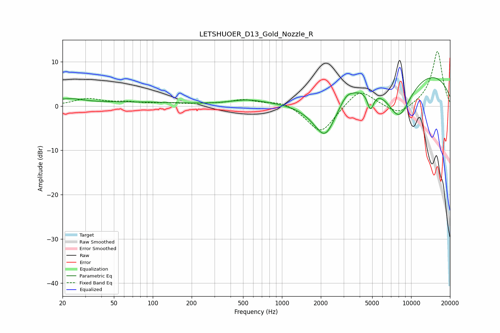

# LETSHUOER_D13_Gold_Nozzle_R
See [usage instructions](https://github.com/jaakkopasanen/AutoEq#usage) for more options and info.

### Parametric EQs
Apply preamp of -6.5 dB when using parametric equalizer.

|   # | Type    |   Fc (Hz) |    Q |   Gain (dB) |
|-----|---------|-----------|------|-------------|
|   1 | Peaking |        23 | 1.3  |         1   |
|   2 | Peaking |        25 | 0.54 |        -0.5 |
|   3 | Peaking |        33 | 0.18 |         1.1 |
|   4 | Peaking |       537 | 1.04 |         1.1 |
|   5 | Peaking |      1745 | 0.88 |        -1.6 |
|   6 | Peaking |      2167 | 1.52 |        -9.5 |
|   7 | Peaking |      3163 | 3.2  |         1.3 |
|   8 | Peaking |      4851 | 5.6  |        -4.2 |
|   9 | Peaking |      8040 | 1.17 |       -11   |
|  10 | Peaking |      8716 | 0.21 |         9.6 |

### Fixed Band EQs
When using fixed band (also called graphic) equalizer, apply preamp of **-12.4 dB** (if available) and set gains manually with these parameters.

|   # | Type    |   Fc (Hz) |    Q |   Gain (dB) |
|-----|---------|-----------|------|-------------|
|   1 | Peaking |        31 | 1.41 |         1.6 |
|   2 | Peaking |        62 | 1.41 |         0.7 |
|   3 | Peaking |       125 | 1.41 |         0.5 |
|   4 | Peaking |       250 | 1.41 |         0.3 |
|   5 | Peaking |       500 | 1.41 |         1.3 |
|   6 | Peaking |      1000 | 1.41 |         1.2 |
|   7 | Peaking |      2000 | 1.41 |        -6.3 |
|   8 | Peaking |      4000 | 1.41 |         4.1 |
|   9 | Peaking |      8000 | 1.41 |        -2.3 |
|  10 | Peaking |     16000 | 1.41 |        12.5 |

### Graphs

