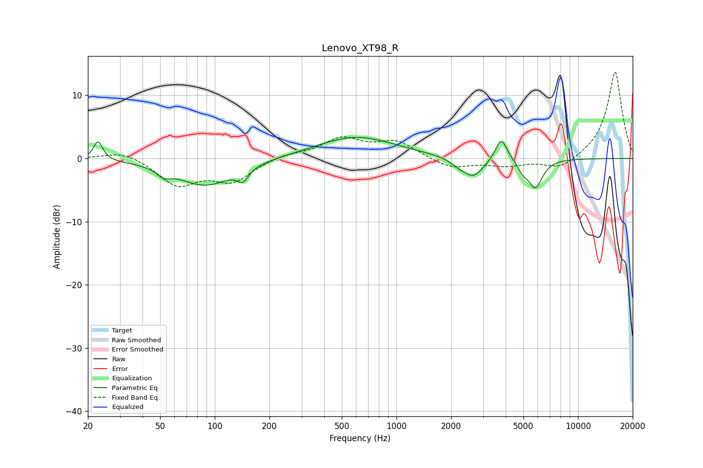

# Lenovo_XT98_R
See [usage instructions](https://github.com/jaakkopasanen/AutoEq#usage) for more options and info.

### Parametric EQs
Apply preamp of -3.4 dB when using parametric equalizer.

|   # | Type    |   Fc (Hz) |    Q |   Gain (dB) |
|-----|---------|-----------|------|-------------|
|   1 | Peaking |        23 | 5.78 |         3   |
|   2 | Peaking |        52 | 4.04 |        -1.1 |
|   3 | Peaking |        89 | 0.9  |        -4.3 |
|   4 | Peaking |       142 | 4.83 |        -1.9 |
|   5 | Peaking |       598 | 0.65 |         3.5 |
|   6 | Peaking |      2177 | 3.23 |        -0.7 |
|   7 | Peaking |      2648 | 2.42 |        -3   |
|   8 | Peaking |      3778 | 4.42 |         3.7 |
|   9 | Peaking |      4961 | 5.69 |        -1.3 |
|  10 | Peaking |      5815 | 3.53 |        -4.5 |

### Fixed Band EQs
When using fixed band (also called graphic) equalizer, apply preamp of **-13.7 dB** (if available) and set gains manually with these parameters.

|   # | Type    |   Fc (Hz) |    Q |   Gain (dB) |
|-----|---------|-----------|------|-------------|
|   1 | Peaking |        31 | 1.41 |         1.3 |
|   2 | Peaking |        62 | 1.41 |        -4.1 |
|   3 | Peaking |       125 | 1.41 |        -3.4 |
|   4 | Peaking |       250 | 1.41 |         0.7 |
|   5 | Peaking |       500 | 1.41 |         3   |
|   6 | Peaking |      1000 | 1.41 |         2.6 |
|   7 | Peaking |      2000 | 1.41 |        -1.6 |
|   8 | Peaking |      4000 | 1.41 |        -1.1 |
|   9 | Peaking |      8000 | 1.41 |        -1.9 |
|  10 | Peaking |     16000 | 1.41 |        13.8 |

### Graphs

