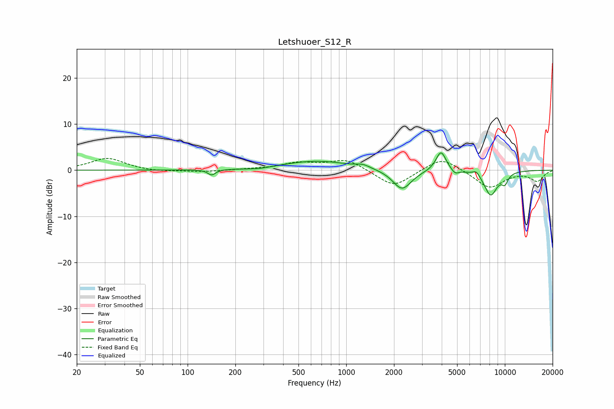

# Letshuoer_S12_R
See [usage instructions](https://github.com/jaakkopasanen/AutoEq#usage) for more options and info.

### Parametric EQs
Apply preamp of -3.9 dB when using parametric equalizer.

|   # | Type    |   Fc (Hz) |    Q |   Gain (dB) |
|-----|---------|-----------|------|-------------|
|   1 | Peaking |       142 | 6    |        -1.2 |
|   2 | Peaking |       279 | 2.02 |        -0.4 |
|   3 | Peaking |       653 | 0.67 |         2   |
|   4 | Peaking |      1277 | 3.38 |         0.7 |
|   5 | Peaking |      2248 | 2.42 |        -4.4 |
|   6 | Peaking |      3957 | 4.39 |         4.4 |
|   7 | Peaking |      4852 | 6    |        -1   |
|   8 | Peaking |      6618 | 6    |         1.1 |
|   9 | Peaking |      8138 | 3.09 |        -5.3 |
|  10 | Peaking |     10000 | 5.85 |        -2   |

### Fixed Band EQs
When using fixed band (also called graphic) equalizer, apply preamp of **-2.6 dB** (if available) and set gains manually with these parameters.

|   # | Type    |   Fc (Hz) |    Q |   Gain (dB) |
|-----|---------|-----------|------|-------------|
|   1 | Peaking |        31 | 1.41 |         2.6 |
|   2 | Peaking |        62 | 1.41 |        -0.4 |
|   3 | Peaking |       125 | 1.41 |        -0.4 |
|   4 | Peaking |       250 | 1.41 |         0.2 |
|   5 | Peaking |       500 | 1.41 |         1.5 |
|   6 | Peaking |      1000 | 1.41 |         2.4 |
|   7 | Peaking |      2000 | 1.41 |        -3.8 |
|   8 | Peaking |      4000 | 1.41 |         3   |
|   9 | Peaking |      8000 | 1.41 |        -3.9 |
|  10 | Peaking |     16000 | 1.41 |        -2.3 |

### Graphs

