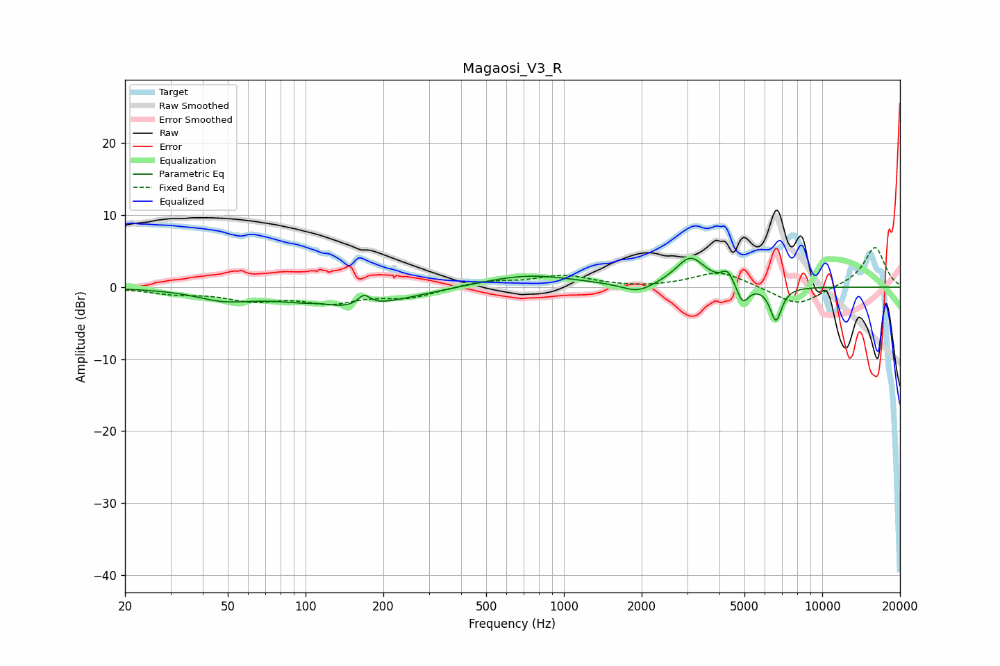

# Magaosi_V3_R
See [usage instructions](https://github.com/jaakkopasanen/AutoEq#usage) for more options and info.

### Parametric EQs
Apply preamp of -4.1 dB when using parametric equalizer.

|   # | Type    |   Fc (Hz) |    Q |   Gain (dB) |
|-----|---------|-----------|------|-------------|
|   1 | Peaking |        48 | 1.36 |        -1.3 |
|   2 | Peaking |       115 | 2.54 |         0.4 |
|   3 | Peaking |       144 | 0.67 |        -3   |
|   4 | Peaking |       168 | 5.89 |         1.5 |
|   5 | Peaking |       722 | 0.77 |         1.8 |
|   6 | Peaking |      1929 | 2.38 |        -1.3 |
|   7 | Peaking |      3092 | 2.45 |         4.1 |
|   8 | Peaking |      4309 | 6    |         1.9 |
|   9 | Peaking |      4921 | 6    |        -2.6 |
|  10 | Peaking |      6619 | 6    |        -4.7 |

### Fixed Band EQs
When using fixed band (also called graphic) equalizer, apply preamp of **-5.6 dB** (if available) and set gains manually with these parameters.

|   # | Type    |   Fc (Hz) |    Q |   Gain (dB) |
|-----|---------|-----------|------|-------------|
|   1 | Peaking |        31 | 1.41 |        -0.8 |
|   2 | Peaking |        62 | 1.41 |        -1.6 |
|   3 | Peaking |       125 | 1.41 |        -1.9 |
|   4 | Peaking |       250 | 1.41 |        -1.3 |
|   5 | Peaking |       500 | 1.41 |         0.8 |
|   6 | Peaking |      1000 | 1.41 |         1.5 |
|   7 | Peaking |      2000 | 1.41 |        -0.2 |
|   8 | Peaking |      4000 | 1.41 |         2.2 |
|   9 | Peaking |      8000 | 1.41 |        -2.7 |
|  10 | Peaking |     16000 | 1.41 |         5.6 |

### Graphs

