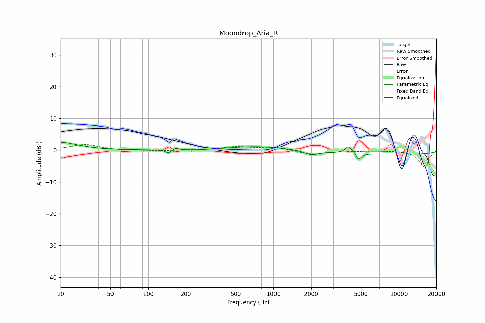

# Moondrop_Aria_R
See [usage instructions](https://github.com/jaakkopasanen/AutoEq#usage) for more options and info.

### Parametric EQs
Apply preamp of -2.5 dB when using parametric equalizer.

|   # | Type    |   Fc (Hz) |    Q |   Gain (dB) |
|-----|---------|-----------|------|-------------|
|   1 | Peaking |        20 | 1.08 |         2.4 |
|   2 | Peaking |       145 | 5.95 |        -1.1 |
|   3 | Peaking |       166 | 6    |         0.7 |
|   4 | Peaking |       247 | 1.57 |        -0.2 |
|   5 | Peaking |       762 | 0.59 |         1.2 |
|   6 | Peaking |      2004 | 2.7  |        -1.3 |
|   7 | Peaking |      3960 | 5.57 |         2.1 |
|   8 | Peaking |      4517 | 4.72 |         0.9 |
|   9 | Peaking |      4751 | 6    |        -2.8 |
|  10 | Peaking |     10000 | 0.18 |        -1.3 |

### Fixed Band EQs
When using fixed band (also called graphic) equalizer, apply preamp of **-1.9 dB** (if available) and set gains manually with these parameters.

|   # | Type    |   Fc (Hz) |    Q |   Gain (dB) |
|-----|---------|-----------|------|-------------|
|   1 | Peaking |        31 | 1.41 |         1.8 |
|   2 | Peaking |        62 | 1.41 |        -0.1 |
|   3 | Peaking |       125 | 1.41 |        -0.2 |
|   4 | Peaking |       250 | 1.41 |         0   |
|   5 | Peaking |       500 | 1.41 |         1   |
|   6 | Peaking |      1000 | 1.41 |         1   |
|   7 | Peaking |      2000 | 1.41 |        -1.3 |
|   8 | Peaking |      4000 | 1.41 |        -0.3 |
|   9 | Peaking |      8000 | 1.41 |        -0.1 |
|  10 | Peaking |     16000 | 1.41 |        -5.3 |

### Graphs

