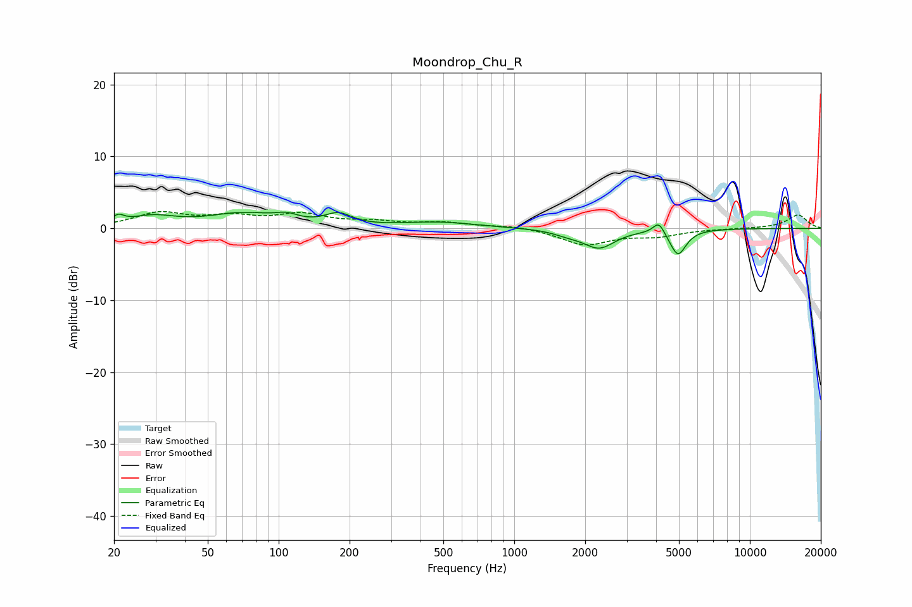

# Moondrop_Chu_R
See [usage instructions](https://github.com/jaakkopasanen/AutoEq#usage) for more options and info.

### Parametric EQs
Apply preamp of -2.4 dB when using parametric equalizer.

|   # | Type    |   Fc (Hz) |    Q |   Gain (dB) |
|-----|---------|-----------|------|-------------|
|   1 | Peaking |        21 | 5.82 |         1   |
|   2 | Peaking |        29 | 1.41 |         1.4 |
|   3 | Peaking |        71 | 0.97 |         1.9 |
|   4 | Peaking |       108 | 2.98 |         0.8 |
|   5 | Peaking |       179 | 2.55 |         1.6 |
|   6 | Peaking |       476 | 0.89 |         0.8 |
|   7 | Peaking |      1686 | 2.36 |        -0.5 |
|   8 | Peaking |      2292 | 2.13 |        -2.6 |
|   9 | Peaking |      4109 | 5.79 |         1.7 |
|  10 | Peaking |      4951 | 4.12 |        -3.6 |

### Fixed Band EQs
When using fixed band (also called graphic) equalizer, apply preamp of **-2.4 dB** (if available) and set gains manually with these parameters.

|   # | Type    |   Fc (Hz) |    Q |   Gain (dB) |
|-----|---------|-----------|------|-------------|
|   1 | Peaking |        31 | 1.41 |         2   |
|   2 | Peaking |        62 | 1.41 |         1.4 |
|   3 | Peaking |       125 | 1.41 |         1.7 |
|   4 | Peaking |       250 | 1.41 |         0.8 |
|   5 | Peaking |       500 | 1.41 |         0.7 |
|   6 | Peaking |      1000 | 1.41 |         0.4 |
|   7 | Peaking |      2000 | 1.41 |        -2.2 |
|   8 | Peaking |      4000 | 1.41 |        -0.9 |
|   9 | Peaking |      8000 | 1.41 |        -0   |
|  10 | Peaking |     16000 | 1.41 |         1.9 |

### Graphs

