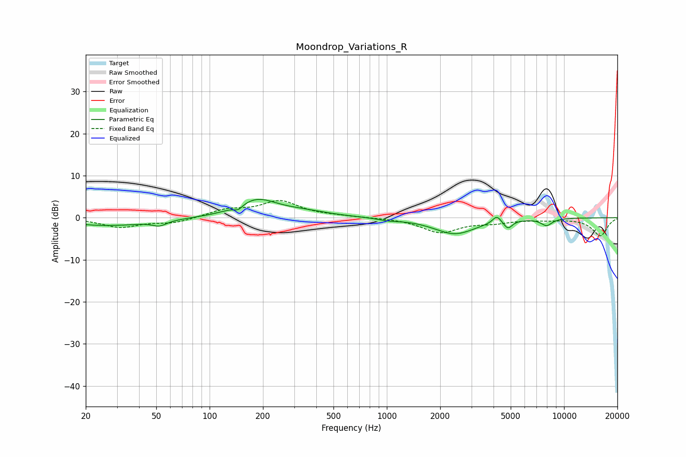

# Moondrop_Variations_R
See [usage instructions](https://github.com/jaakkopasanen/AutoEq#usage) for more options and info.

### Parametric EQs
Apply preamp of -4.4 dB when using parametric equalizer.

|   # | Type    |   Fc (Hz) |    Q |   Gain (dB) |
|-----|---------|-----------|------|-------------|
|   1 | Peaking |        27 | 0.58 |        -1.9 |
|   2 | Peaking |        52 | 3.75 |        -1.1 |
|   3 | Peaking |       145 | 6    |        -1.1 |
|   4 | Peaking |       185 | 1.26 |         4.1 |
|   5 | Peaking |       336 | 0.93 |         1.1 |
|   6 | Peaking |      1024 | 2.47 |        -0.4 |
|   7 | Peaking |      2417 | 1.19 |        -3.8 |
|   8 | Peaking |      4172 | 6    |         1.8 |
|   9 | Peaking |      4826 | 6    |        -1.9 |
|  10 | Peaking |      7964 | 4.24 |        -1.6 |

### Fixed Band EQs
When using fixed band (also called graphic) equalizer, apply preamp of **-4.2 dB** (if available) and set gains manually with these parameters.

|   # | Type    |   Fc (Hz) |    Q |   Gain (dB) |
|-----|---------|-----------|------|-------------|
|   1 | Peaking |        31 | 1.41 |        -2.2 |
|   2 | Peaking |        62 | 1.41 |        -1.2 |
|   3 | Peaking |       125 | 1.41 |         1.8 |
|   4 | Peaking |       250 | 1.41 |         3.8 |
|   5 | Peaking |       500 | 1.41 |         0.3 |
|   6 | Peaking |      1000 | 1.41 |         0   |
|   7 | Peaking |      2000 | 1.41 |        -3.4 |
|   8 | Peaking |      4000 | 1.41 |        -1   |
|   9 | Peaking |      8000 | 1.41 |        -0.4 |
|  10 | Peaking |     16000 | 1.41 |        -4.3 |

### Graphs

