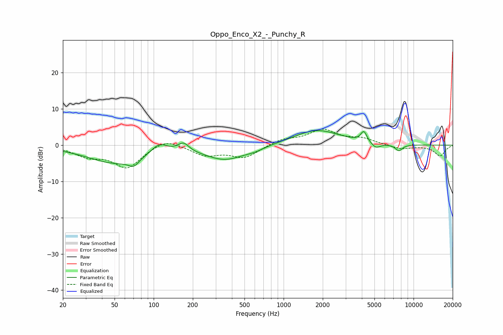

# Oppo_Enco_X2_-_Punchy_R
See [usage instructions](https://github.com/jaakkopasanen/AutoEq#usage) for more options and info.

### Parametric EQs
Apply preamp of -4.1 dB when using parametric equalizer.

|   # | Type    |   Fc (Hz) |    Q |   Gain (dB) |
|-----|---------|-----------|------|-------------|
|   1 | Peaking |        53 | 0.62 |        -4.9 |
|   2 | Peaking |        70 | 3.81 |        -1.9 |
|   3 | Peaking |       110 | 2.24 |         2.9 |
|   4 | Peaking |       169 | 3.39 |         2.4 |
|   5 | Peaking |       355 | 0.93 |        -3.9 |
|   6 | Peaking |       602 | 1.97 |        -0.7 |
|   7 | Peaking |      1804 | 0.79 |         4.2 |
|   8 | Peaking |      4144 | 5.96 |         2.9 |
|   9 | Peaking |      5123 | 3.86 |        -1.5 |
|  10 | Peaking |      7705 | 4.64 |        -1.8 |

### Fixed Band EQs
When using fixed band (also called graphic) equalizer, apply preamp of **-4.5 dB** (if available) and set gains manually with these parameters.

|   # | Type    |   Fc (Hz) |    Q |   Gain (dB) |
|-----|---------|-----------|------|-------------|
|   1 | Peaking |        31 | 1.41 |        -2.7 |
|   2 | Peaking |        62 | 1.41 |        -6.1 |
|   3 | Peaking |       125 | 1.41 |         2.2 |
|   4 | Peaking |       250 | 1.41 |        -2.7 |
|   5 | Peaking |       500 | 1.41 |        -3.3 |
|   6 | Peaking |      1000 | 1.41 |         1.6 |
|   7 | Peaking |      2000 | 1.41 |         4   |
|   8 | Peaking |      4000 | 1.41 |         1.6 |
|   9 | Peaking |      8000 | 1.41 |        -1.1 |
|  10 | Peaking |     16000 | 1.41 |        -2.9 |

### Graphs

