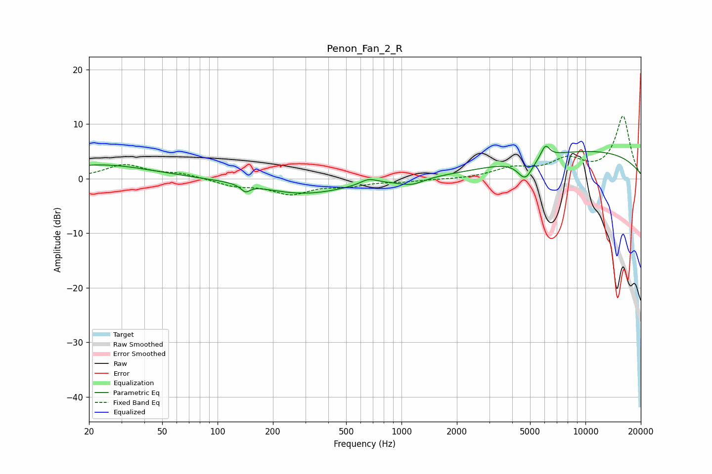

# Penon_Fan_2_R
See [usage instructions](https://github.com/jaakkopasanen/AutoEq#usage) for more options and info.

### Parametric EQs
Apply preamp of -6.1 dB when using parametric equalizer.

|   # | Type    |   Fc (Hz) |    Q |   Gain (dB) |
|-----|---------|-----------|------|-------------|
|   1 | Peaking |        23 | 0.52 |         2.6 |
|   2 | Peaking |       142 | 5.9  |        -1.3 |
|   3 | Peaking |       295 | 0.61 |        -2.7 |
|   4 | Peaking |       662 | 3.19 |         1   |
|   5 | Peaking |       949 | 3.45 |        -0.1 |
|   6 | Peaking |      1139 | 2.2  |        -1.1 |
|   7 | Peaking |      4710 | 3.37 |        -3.6 |
|   8 | Peaking |      5563 | 4.45 |         0.1 |
|   9 | Peaking |      6061 | 6    |         2.3 |
|  10 | Peaking |     10000 | 0.27 |         5   |

### Fixed Band EQs
When using fixed band (also called graphic) equalizer, apply preamp of **-11.6 dB** (if available) and set gains manually with these parameters.

|   # | Type    |   Fc (Hz) |    Q |   Gain (dB) |
|-----|---------|-----------|------|-------------|
|   1 | Peaking |        31 | 1.41 |         2.5 |
|   2 | Peaking |        62 | 1.41 |         0.9 |
|   3 | Peaking |       125 | 1.41 |        -1.2 |
|   4 | Peaking |       250 | 1.41 |        -2.6 |
|   5 | Peaking |       500 | 1.41 |        -1.1 |
|   6 | Peaking |      1000 | 1.41 |        -0.4 |
|   7 | Peaking |      2000 | 1.41 |        -0.1 |
|   8 | Peaking |      4000 | 1.41 |         1.7 |
|   9 | Peaking |      8000 | 1.41 |         3.2 |
|  10 | Peaking |     16000 | 1.41 |        11.4 |

### Graphs

