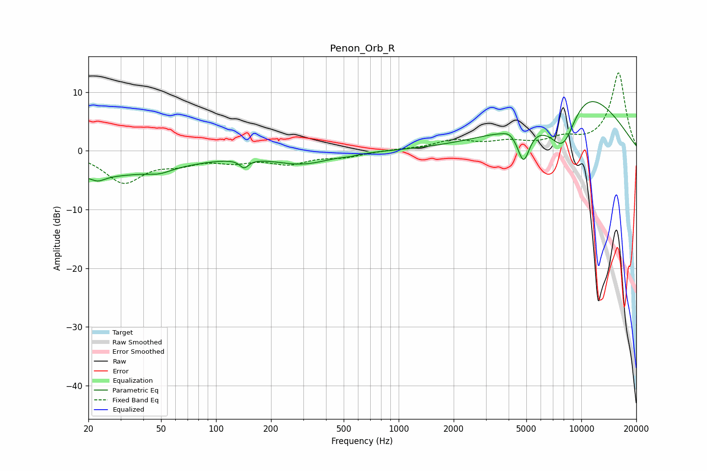

# Penon_Orb_R
See [usage instructions](https://github.com/jaakkopasanen/AutoEq#usage) for more options and info.

### Parametric EQs
Apply preamp of -8.5 dB when using parametric equalizer.

|   # | Type    |   Fc (Hz) |    Q |   Gain (dB) |
|-----|---------|-----------|------|-------------|
|   1 | Peaking |        22 | 0.32 |        -4.2 |
|   2 | Peaking |        23 | 3.62 |        -0.9 |
|   3 | Peaking |        49 | 2.35 |        -0.7 |
|   4 | Peaking |       143 | 5.94 |        -1.4 |
|   5 | Peaking |       298 | 0.92 |        -2.1 |
|   6 | Peaking |       540 | 4.1  |        -0.2 |
|   7 | Peaking |      4055 | 4.84 |         0.5 |
|   8 | Peaking |      4830 | 4.12 |        -5.8 |
|   9 | Peaking |      7969 | 1.39 |       -11   |
|  10 | Peaking |      9420 | 0.52 |        13.6 |

### Fixed Band EQs
When using fixed band (also called graphic) equalizer, apply preamp of **-13.4 dB** (if available) and set gains manually with these parameters.

|   # | Type    |   Fc (Hz) |    Q |   Gain (dB) |
|-----|---------|-----------|------|-------------|
|   1 | Peaking |        31 | 1.41 |        -5.2 |
|   2 | Peaking |        62 | 1.41 |        -1.7 |
|   3 | Peaking |       125 | 1.41 |        -1.5 |
|   4 | Peaking |       250 | 1.41 |        -1.9 |
|   5 | Peaking |       500 | 1.41 |        -0.9 |
|   6 | Peaking |      1000 | 1.41 |         0.2 |
|   7 | Peaking |      2000 | 1.41 |         1.6 |
|   8 | Peaking |      4000 | 1.41 |         1.3 |
|   9 | Peaking |      8000 | 1.41 |         1.7 |
|  10 | Peaking |     16000 | 1.41 |        13.3 |

### Graphs

