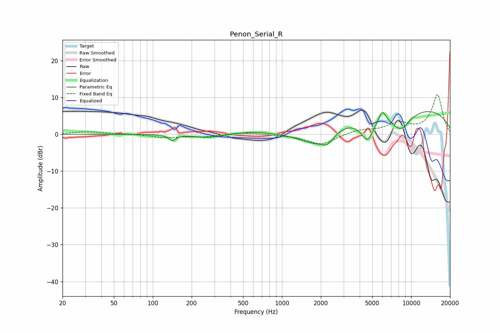

# Penon_Serial_R
See [usage instructions](https://github.com/jaakkopasanen/AutoEq#usage) for more options and info.

### Parametric EQs
Apply preamp of -6.3 dB when using parametric equalizer.

|   # | Type    |   Fc (Hz) |    Q |   Gain (dB) |
|-----|---------|-----------|------|-------------|
|   1 | Peaking |       142 | 5.35 |        -1.5 |
|   2 | Peaking |       268 | 1.29 |        -0.9 |
|   3 | Peaking |       596 | 1.1  |         0.7 |
|   4 | Peaking |      1828 | 0.99 |        -4.7 |
|   5 | Peaking |      2253 | 2.89 |        -2.4 |
|   6 | Peaking |      4589 | 2.68 |        -6.5 |
|   7 | Peaking |      5982 | 4.79 |         3.2 |
|   8 | Peaking |      8306 | 1.52 |        -5.7 |
|   9 | Peaking |      8946 | 0.21 |         7.8 |
|  10 | Peaking |     10000 | 6    |         0.2 |

### Fixed Band EQs
When using fixed band (also called graphic) equalizer, apply preamp of **-10.8 dB** (if available) and set gains manually with these parameters.

|   # | Type    |   Fc (Hz) |    Q |   Gain (dB) |
|-----|---------|-----------|------|-------------|
|   1 | Peaking |        31 | 1.41 |         0.7 |
|   2 | Peaking |        62 | 1.41 |         0.1 |
|   3 | Peaking |       125 | 1.41 |        -0.9 |
|   4 | Peaking |       250 | 1.41 |        -0.7 |
|   5 | Peaking |       500 | 1.41 |         0.6 |
|   6 | Peaking |      1000 | 1.41 |        -0.2 |
|   7 | Peaking |      2000 | 1.41 |        -2.8 |
|   8 | Peaking |      4000 | 1.41 |         1.1 |
|   9 | Peaking |      8000 | 1.41 |         2.7 |
|  10 | Peaking |     16000 | 1.41 |        10.7 |

### Graphs

