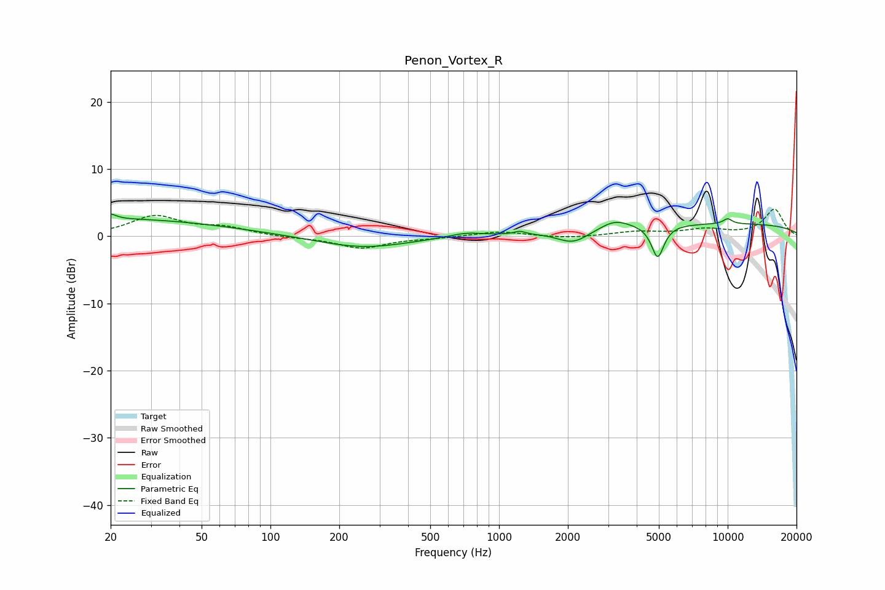

# Penon_Vortex_R
See [usage instructions](https://github.com/jaakkopasanen/AutoEq#usage) for more options and info.

### Parametric EQs
Apply preamp of -3.4 dB when using parametric equalizer.

|   # | Type    |   Fc (Hz) |    Q |   Gain (dB) |
|-----|---------|-----------|------|-------------|
|   1 | Peaking |        20 | 5.93 |         0.7 |
|   2 | Peaking |        20 | 0.27 |         2.6 |
|   3 | Peaking |       254 | 0.72 |        -1.8 |
|   4 | Peaking |       714 | 1.9  |         0.6 |
|   5 | Peaking |      1233 | 5.93 |         0.5 |
|   6 | Peaking |      2111 | 2    |        -2   |
|   7 | Peaking |      3209 | 2.23 |         1.3 |
|   8 | Peaking |      4942 | 5.13 |        -4.9 |
|   9 | Peaking |      8928 | 0.18 |         1.9 |
|  10 | Peaking |     10000 | 5.99 |         0.8 |

### Fixed Band EQs
When using fixed band (also called graphic) equalizer, apply preamp of **-4.1 dB** (if available) and set gains manually with these parameters.

|   # | Type    |   Fc (Hz) |    Q |   Gain (dB) |
|-----|---------|-----------|------|-------------|
|   1 | Peaking |        31 | 1.41 |         2.9 |
|   2 | Peaking |        62 | 1.41 |         1.2 |
|   3 | Peaking |       125 | 1.41 |        -0.2 |
|   4 | Peaking |       250 | 1.41 |        -1.8 |
|   5 | Peaking |       500 | 1.41 |        -0.2 |
|   6 | Peaking |      1000 | 1.41 |         0.7 |
|   7 | Peaking |      2000 | 1.41 |        -0.3 |
|   8 | Peaking |      4000 | 1.41 |         0.6 |
|   9 | Peaking |      8000 | 1.41 |         0.9 |
|  10 | Peaking |     16000 | 1.41 |         4   |

### Graphs

