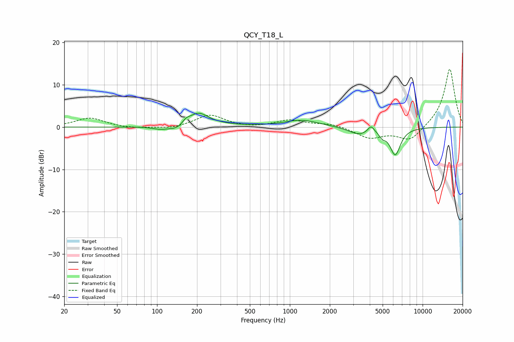

# QCY_T18_L
See [usage instructions](https://github.com/jaakkopasanen/AutoEq#usage) for more options and info.

### Parametric EQs
Apply preamp of -3.3 dB when using parametric equalizer.

|   # | Type    |   Fc (Hz) |    Q |   Gain (dB) |
|-----|---------|-----------|------|-------------|
|   1 | Peaking |       105 | 2.62 |        -0.5 |
|   2 | Peaking |       145 | 1.93 |        -1.5 |
|   3 | Peaking |       165 | 4.8  |         1.1 |
|   4 | Peaking |       203 | 1.82 |         3.3 |
|   5 | Peaking |       287 | 0.87 |         0.3 |
|   6 | Peaking |      1225 | 1.07 |         1.6 |
|   7 | Peaking |      3301 | 1.85 |        -1.7 |
|   8 | Peaking |      4087 | 6    |         1.6 |
|   9 | Peaking |      4977 | 5.98 |        -1.2 |
|  10 | Peaking |      6214 | 3.47 |        -6.3 |

### Fixed Band EQs
When using fixed band (also called graphic) equalizer, apply preamp of **-13.7 dB** (if available) and set gains manually with these parameters.

|   # | Type    |   Fc (Hz) |    Q |   Gain (dB) |
|-----|---------|-----------|------|-------------|
|   1 | Peaking |        31 | 1.41 |         2.2 |
|   2 | Peaking |        62 | 1.41 |        -0.3 |
|   3 | Peaking |       125 | 1.41 |        -0.5 |
|   4 | Peaking |       250 | 1.41 |         2.9 |
|   5 | Peaking |       500 | 1.41 |        -0.3 |
|   6 | Peaking |      1000 | 1.41 |         1.6 |
|   7 | Peaking |      2000 | 1.41 |         0.8 |
|   8 | Peaking |      4000 | 1.41 |        -2.5 |
|   9 | Peaking |      8000 | 1.41 |        -3.4 |
|  10 | Peaking |     16000 | 1.41 |        13.9 |

### Graphs

