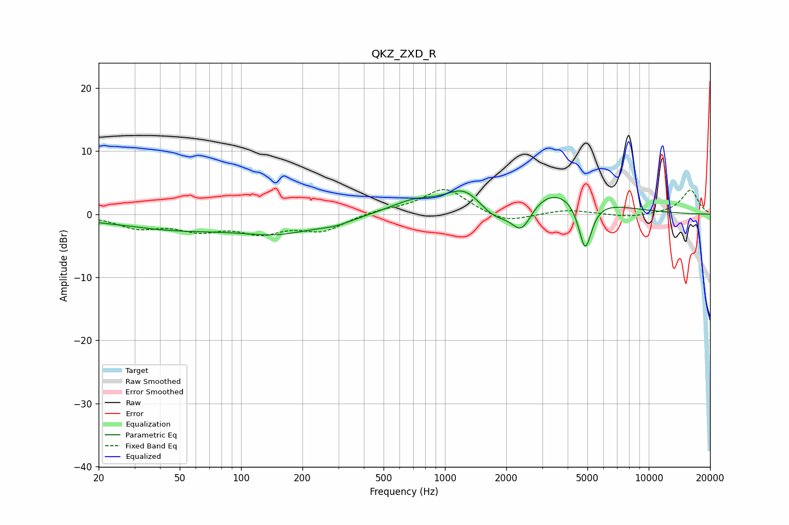

# QKZ_ZXD_R
See [usage instructions](https://github.com/jaakkopasanen/AutoEq#usage) for more options and info.

### Parametric EQs
Apply preamp of -3.8 dB when using parametric equalizer.

|   # | Type    |   Fc (Hz) |    Q |   Gain (dB) |
|-----|---------|-----------|------|-------------|
|   1 | Peaking |        28 | 1.74 |         0.1 |
|   2 | Peaking |        48 | 0.43 |        -2.3 |
|   3 | Peaking |       153 | 0.81 |        -2.2 |
|   4 | Peaking |       289 | 1.52 |        -0.9 |
|   5 | Peaking |       703 | 1.21 |         1.9 |
|   6 | Peaking |      1244 | 1.61 |         3.3 |
|   7 | Peaking |      1755 | 1.75 |        -2.8 |
|   8 | Peaking |      2380 | 2.68 |        -4.9 |
|   9 | Peaking |      3384 | 0.67 |         4.6 |
|  10 | Peaking |      4876 | 4.12 |        -8.3 |

### Fixed Band EQs
When using fixed band (also called graphic) equalizer, apply preamp of **-4.0 dB** (if available) and set gains manually with these parameters.

|   # | Type    |   Fc (Hz) |    Q |   Gain (dB) |
|-----|---------|-----------|------|-------------|
|   1 | Peaking |        31 | 1.41 |        -1.9 |
|   2 | Peaking |        62 | 1.41 |        -2.2 |
|   3 | Peaking |       125 | 1.41 |        -2.5 |
|   4 | Peaking |       250 | 1.41 |        -2.5 |
|   5 | Peaking |       500 | 1.41 |         0.6 |
|   6 | Peaking |      1000 | 1.41 |         4.2 |
|   7 | Peaking |      2000 | 1.41 |        -1.5 |
|   8 | Peaking |      4000 | 1.41 |         0.7 |
|   9 | Peaking |      8000 | 1.41 |        -0.5 |
|  10 | Peaking |     16000 | 1.41 |         3.8 |

### Graphs

