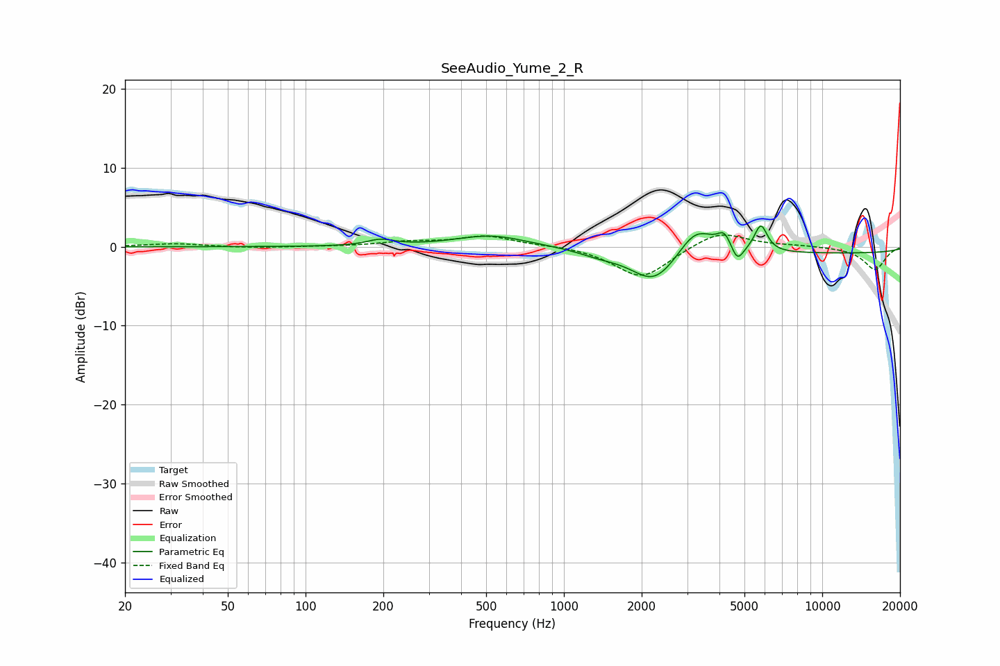

# SeeAudio_Yume_2_R
See [usage instructions](https://github.com/jaakkopasanen/AutoEq#usage) for more options and info.

### Parametric EQs
Apply preamp of -2.7 dB when using parametric equalizer.

|   # | Type    |   Fc (Hz) |    Q |   Gain (dB) |
|-----|---------|-----------|------|-------------|
|   1 | Peaking |       195 | 2.78 |         0.8 |
|   2 | Peaking |       523 | 1.04 |         1.5 |
|   3 | Peaking |      1377 | 1.71 |        -0.7 |
|   4 | Peaking |      2233 | 1.61 |        -4.1 |
|   5 | Peaking |      3192 | 2.21 |         2.9 |
|   6 | Peaking |      3569 | 2.2  |         0.8 |
|   7 | Peaking |      4181 | 5.47 |         1.9 |
|   8 | Peaking |      4695 | 6    |        -2   |
|   9 | Peaking |      5785 | 5.55 |         3.4 |
|  10 | Peaking |     10000 | 0.18 |        -0.8 |

### Fixed Band EQs
When using fixed band (also called graphic) equalizer, apply preamp of **-1.6 dB** (if available) and set gains manually with these parameters.

|   # | Type    |   Fc (Hz) |    Q |   Gain (dB) |
|-----|---------|-----------|------|-------------|
|   1 | Peaking |        31 | 1.41 |         0.4 |
|   2 | Peaking |        62 | 1.41 |        -0.2 |
|   3 | Peaking |       125 | 1.41 |         0   |
|   4 | Peaking |       250 | 1.41 |         0.6 |
|   5 | Peaking |       500 | 1.41 |         1.3 |
|   6 | Peaking |      1000 | 1.41 |         0.2 |
|   7 | Peaking |      2000 | 1.41 |        -4   |
|   8 | Peaking |      4000 | 1.41 |         2.1 |
|   9 | Peaking |      8000 | 1.41 |         0.2 |
|  10 | Peaking |     16000 | 1.41 |        -2.9 |

### Graphs

