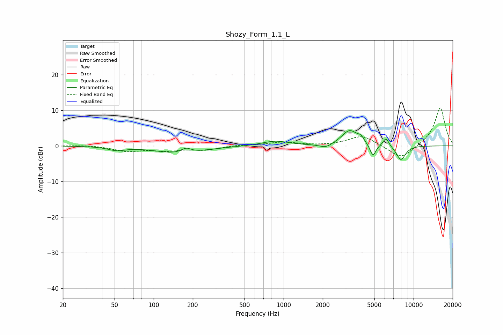

# Shozy_Form_1.1_L
See [usage instructions](https://github.com/jaakkopasanen/AutoEq#usage) for more options and info.

### Parametric EQs
Apply preamp of -4.4 dB when using parametric equalizer.

|   # | Type    |   Fc (Hz) |    Q |   Gain (dB) |
|-----|---------|-----------|------|-------------|
|   1 | Peaking |        52 | 2.28 |        -1   |
|   2 | Peaking |       159 | 0.78 |        -2.1 |
|   3 | Peaking |       178 | 3.69 |         1.4 |
|   4 | Peaking |       860 | 1.4  |         1.4 |
|   5 | Peaking |      2114 | 2.96 |        -1.2 |
|   6 | Peaking |      3225 | 2.25 |         4.3 |
|   7 | Peaking |      3936 | 6    |         1.2 |
|   8 | Peaking |      4863 | 5.99 |        -3.5 |
|   9 | Peaking |      6131 | 6    |         2.5 |
|  10 | Peaking |      7988 | 3.7  |        -4.1 |

### Fixed Band EQs
When using fixed band (also called graphic) equalizer, apply preamp of **-10.7 dB** (if available) and set gains manually with these parameters.

|   # | Type    |   Fc (Hz) |    Q |   Gain (dB) |
|-----|---------|-----------|------|-------------|
|   1 | Peaking |        31 | 1.41 |         0.2 |
|   2 | Peaking |        62 | 1.41 |        -1.4 |
|   3 | Peaking |       125 | 1.41 |        -1.2 |
|   4 | Peaking |       250 | 1.41 |        -1.1 |
|   5 | Peaking |       500 | 1.41 |         0.3 |
|   6 | Peaking |      1000 | 1.41 |         1   |
|   7 | Peaking |      2000 | 1.41 |        -0   |
|   8 | Peaking |      4000 | 1.41 |         2.9 |
|   9 | Peaking |      8000 | 1.41 |        -3.9 |
|  10 | Peaking |     16000 | 1.41 |        10.9 |

### Graphs

