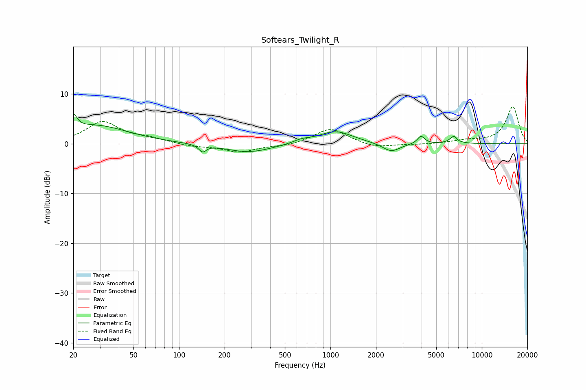

# Softears_Twilight_R
See [usage instructions](https://github.com/jaakkopasanen/AutoEq#usage) for more options and info.

### Parametric EQs
Apply preamp of -6.0 dB when using parametric equalizer.

|   # | Type    |   Fc (Hz) |    Q |   Gain (dB) |
|-----|---------|-----------|------|-------------|
|   1 | Peaking |        20 | 5.72 |         2.9 |
|   2 | Peaking |        28 | 0.65 |         3.6 |
|   3 | Peaking |       143 | 5.98 |        -1.4 |
|   4 | Peaking |       288 | 0.92 |        -1.8 |
|   5 | Peaking |       643 | 2.6  |         0.6 |
|   6 | Peaking |      1079 | 1.26 |         2.6 |
|   7 | Peaking |      2519 | 2.41 |        -1.8 |
|   8 | Peaking |      3966 | 5.95 |         1.6 |
|   9 | Peaking |      6633 | 5.11 |         2.3 |
|  10 | Peaking |      6819 | 6    |        -1.1 |

### Fixed Band EQs
When using fixed band (also called graphic) equalizer, apply preamp of **-7.5 dB** (if available) and set gains manually with these parameters.

|   # | Type    |   Fc (Hz) |    Q |   Gain (dB) |
|-----|---------|-----------|------|-------------|
|   1 | Peaking |        31 | 1.41 |         4.3 |
|   2 | Peaking |        62 | 1.41 |         0.9 |
|   3 | Peaking |       125 | 1.41 |        -0.5 |
|   4 | Peaking |       250 | 1.41 |        -1.6 |
|   5 | Peaking |       500 | 1.41 |        -0.5 |
|   6 | Peaking |      1000 | 1.41 |         3.1 |
|   7 | Peaking |      2000 | 1.41 |        -0.9 |
|   8 | Peaking |      4000 | 1.41 |        -0.1 |
|   9 | Peaking |      8000 | 1.41 |         0.6 |
|  10 | Peaking |     16000 | 1.41 |         7.5 |

### Graphs

