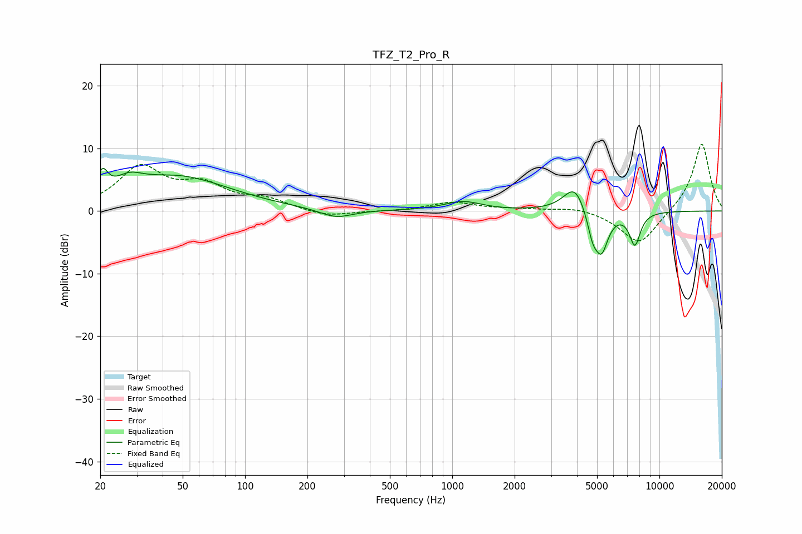

# TFZ_T2_Pro_R
See [usage instructions](https://github.com/jaakkopasanen/AutoEq#usage) for more options and info.

### Parametric EQs
Apply preamp of -6.9 dB when using parametric equalizer.

|   # | Type    |   Fc (Hz) |    Q |   Gain (dB) |
|-----|---------|-----------|------|-------------|
|   1 | Peaking |        20 | 5.64 |         3.4 |
|   2 | Peaking |        27 | 2.15 |         2   |
|   3 | Peaking |        47 | 0.55 |         5.4 |
|   4 | Peaking |       275 | 1.78 |        -1.4 |
|   5 | Peaking |      1124 | 1.56 |         1.5 |
|   6 | Peaking |      3919 | 2.54 |         4.5 |
|   7 | Peaking |      4707 | 3.13 |        -1.2 |
|   8 | Peaking |      4761 | 6    |        -2.6 |
|   9 | Peaking |      5252 | 4.18 |        -6.2 |
|  10 | Peaking |      7611 | 5.04 |        -5.2 |

### Fixed Band EQs
When using fixed band (also called graphic) equalizer, apply preamp of **-10.8 dB** (if available) and set gains manually with these parameters.

|   # | Type    |   Fc (Hz) |    Q |   Gain (dB) |
|-----|---------|-----------|------|-------------|
|   1 | Peaking |        31 | 1.41 |         6.7 |
|   2 | Peaking |        62 | 1.41 |         3.6 |
|   3 | Peaking |       125 | 1.41 |         1.6 |
|   4 | Peaking |       250 | 1.41 |        -1   |
|   5 | Peaking |       500 | 1.41 |        -0.1 |
|   6 | Peaking |      1000 | 1.41 |         1.4 |
|   7 | Peaking |      2000 | 1.41 |         0.3 |
|   8 | Peaking |      4000 | 1.41 |         0.7 |
|   9 | Peaking |      8000 | 1.41 |        -5.5 |
|  10 | Peaking |     16000 | 1.41 |        11   |

### Graphs

