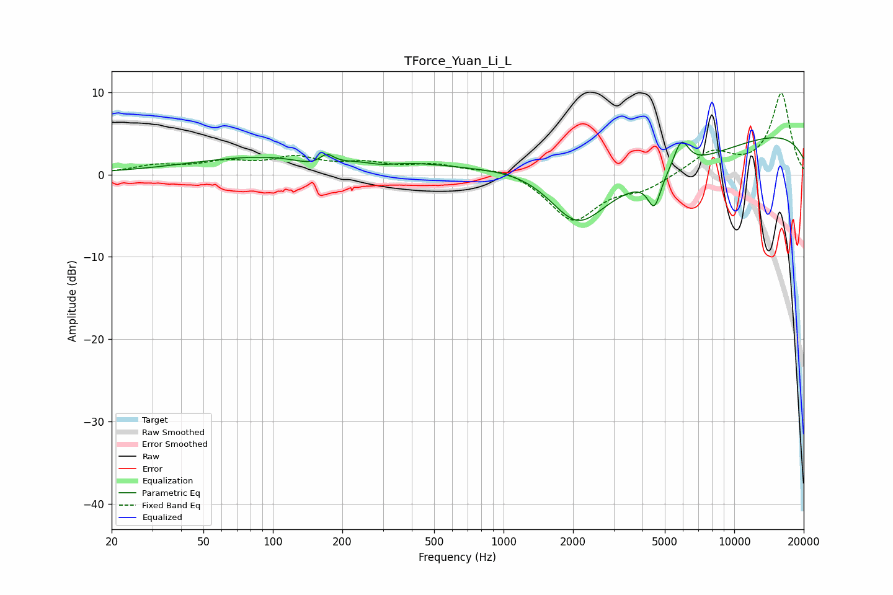

# TForce_Yuan_Li_L
See [usage instructions](https://github.com/jaakkopasanen/AutoEq#usage) for more options and info.

### Parametric EQs
Apply preamp of -4.6 dB when using parametric equalizer.

|   # | Type    |   Fc (Hz) |    Q |   Gain (dB) |
|-----|---------|-----------|------|-------------|
|   1 | Peaking |       159 | 1.39 |        -1.6 |
|   2 | Peaking |       171 | 4.39 |         1.4 |
|   3 | Peaking |       262 | 0.18 |         3.2 |
|   4 | Peaking |       295 | 1.88 |        -0.7 |
|   5 | Peaking |      1475 | 0.5  |         7.2 |
|   6 | Peaking |      2088 | 0.52 |       -20   |
|   7 | Peaking |      2364 | 0.59 |         4.4 |
|   8 | Peaking |      4505 | 4.95 |        -3.8 |
|   9 | Peaking |      5891 | 4.21 |         3.5 |
|  10 | Peaking |     10000 | 0.18 |         5.7 |

### Fixed Band EQs
When using fixed band (also called graphic) equalizer, apply preamp of **-10.0 dB** (if available) and set gains manually with these parameters.

|   # | Type    |   Fc (Hz) |    Q |   Gain (dB) |
|-----|---------|-----------|------|-------------|
|   1 | Peaking |        31 | 1.41 |         1   |
|   2 | Peaking |        62 | 1.41 |         1.3 |
|   3 | Peaking |       125 | 1.41 |         1.8 |
|   4 | Peaking |       250 | 1.41 |         1.1 |
|   5 | Peaking |       500 | 1.41 |         1.1 |
|   6 | Peaking |      1000 | 1.41 |         1   |
|   7 | Peaking |      2000 | 1.41 |        -5.6 |
|   8 | Peaking |      4000 | 1.41 |        -1.6 |
|   9 | Peaking |      8000 | 1.41 |         2.7 |
|  10 | Peaking |     16000 | 1.41 |         9.8 |

### Graphs

