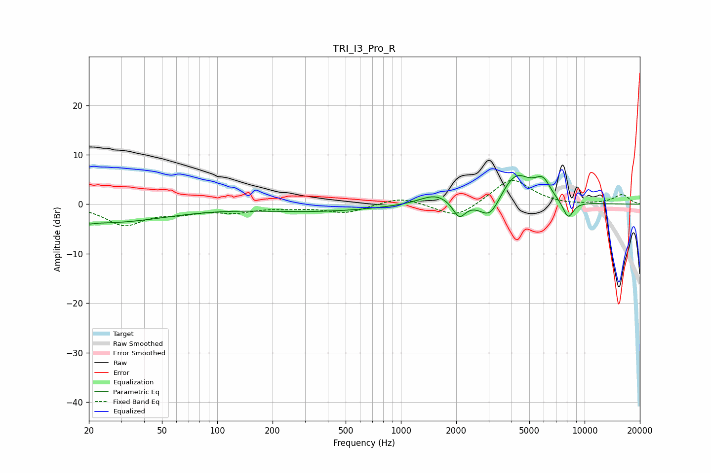

# TRI_I3_Pro_R
See [usage instructions](https://github.com/jaakkopasanen/AutoEq#usage) for more options and info.

### Parametric EQs
Apply preamp of -5.9 dB when using parametric equalizer.

|   # | Type    |   Fc (Hz) |    Q |   Gain (dB) |
|-----|---------|-----------|------|-------------|
|   1 | Peaking |        20 | 5.68 |        -0.4 |
|   2 | Peaking |        24 | 0.4  |        -3.7 |
|   3 | Peaking |       344 | 0.41 |        -1.4 |
|   4 | Peaking |      1549 | 1.6  |         2.2 |
|   5 | Peaking |      2075 | 4.11 |        -3.4 |
|   6 | Peaking |      3054 | 2.46 |        -4.5 |
|   7 | Peaking |      4208 | 1.63 |         6.4 |
|   8 | Peaking |      5608 | 3.33 |         1   |
|   9 | Peaking |      6016 | 3.61 |         2.7 |
|  10 | Peaking |      8137 | 4.43 |        -3.6 |

### Fixed Band EQs
When using fixed band (also called graphic) equalizer, apply preamp of **-4.9 dB** (if available) and set gains manually with these parameters.

|   # | Type    |   Fc (Hz) |    Q |   Gain (dB) |
|-----|---------|-----------|------|-------------|
|   1 | Peaking |        31 | 1.41 |        -4.1 |
|   2 | Peaking |        62 | 1.41 |        -1.4 |
|   3 | Peaking |       125 | 1.41 |        -1.4 |
|   4 | Peaking |       250 | 1.41 |        -0.5 |
|   5 | Peaking |       500 | 1.41 |        -1.7 |
|   6 | Peaking |      1000 | 1.41 |         1.5 |
|   7 | Peaking |      2000 | 1.41 |        -2.9 |
|   8 | Peaking |      4000 | 1.41 |         5.3 |
|   9 | Peaking |      8000 | 1.41 |        -0.2 |
|  10 | Peaking |     16000 | 1.41 |         1.9 |

### Graphs

