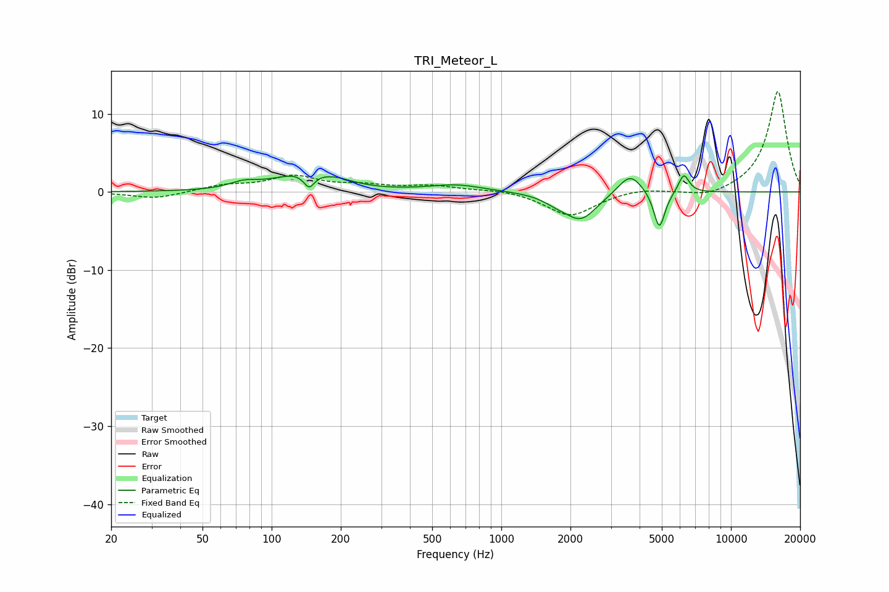

# TRI_Meteor_L
See [usage instructions](https://github.com/jaakkopasanen/AutoEq#usage) for more options and info.

### Parametric EQs
Apply preamp of -2.2 dB when using parametric equalizer.

|   # | Type    |   Fc (Hz) |    Q |   Gain (dB) |
|-----|---------|-----------|------|-------------|
|   1 | Peaking |        76 | 2.35 |         0.8 |
|   2 | Peaking |       132 | 1.17 |         2   |
|   3 | Peaking |       146 | 6    |        -1.8 |
|   4 | Peaking |       188 | 1.7  |         0.8 |
|   5 | Peaking |       636 | 1.19 |         0.9 |
|   6 | Peaking |      1732 | 2.6  |        -0.7 |
|   7 | Peaking |      2219 | 2.01 |        -3.5 |
|   8 | Peaking |      3638 | 2.71 |         2.7 |
|   9 | Peaking |      4877 | 5.72 |        -4.9 |
|  10 | Peaking |      6233 | 6    |         2.4 |

### Fixed Band EQs
When using fixed band (also called graphic) equalizer, apply preamp of **-13.0 dB** (if available) and set gains manually with these parameters.

|   # | Type    |   Fc (Hz) |    Q |   Gain (dB) |
|-----|---------|-----------|------|-------------|
|   1 | Peaking |        31 | 1.41 |        -0.9 |
|   2 | Peaking |        62 | 1.41 |         0.8 |
|   3 | Peaking |       125 | 1.41 |         1.9 |
|   4 | Peaking |       250 | 1.41 |         0.7 |
|   5 | Peaking |       500 | 1.41 |         0.7 |
|   6 | Peaking |      1000 | 1.41 |         0.4 |
|   7 | Peaking |      2000 | 1.41 |        -3.1 |
|   8 | Peaking |      4000 | 1.41 |         0.5 |
|   9 | Peaking |      8000 | 1.41 |        -0.8 |
|  10 | Peaking |     16000 | 1.41 |        13   |

### Graphs

