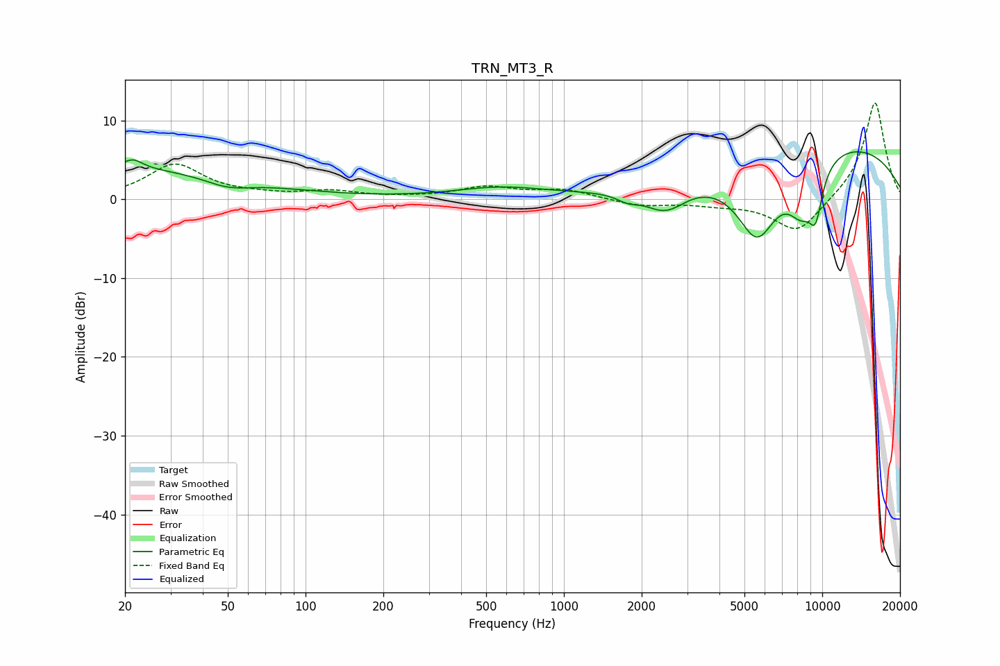

# TRN_MT3_R
See [usage instructions](https://github.com/jaakkopasanen/AutoEq#usage) for more options and info.

### Parametric EQs
Apply preamp of -6.1 dB when using parametric equalizer.

|   # | Type    |   Fc (Hz) |    Q |   Gain (dB) |
|-----|---------|-----------|------|-------------|
|   1 | Peaking |        20 | 0.3  |         3.9 |
|   2 | Peaking |        21 | 3.71 |         1.3 |
|   3 | Peaking |        50 | 1.54 |        -1.3 |
|   4 | Peaking |       568 | 0.79 |         1.3 |
|   5 | Peaking |      1765 | 3.31 |        -0.9 |
|   6 | Peaking |      2474 | 1.67 |        -3.5 |
|   7 | Peaking |      5596 | 1.57 |       -10   |
|   8 | Peaking |      8297 | 2.36 |        -5.4 |
|   9 | Peaking |      9429 | 4.6  |        -5.4 |
|  10 | Peaking |      9839 | 0.26 |         7.7 |

### Fixed Band EQs
When using fixed band (also called graphic) equalizer, apply preamp of **-12.3 dB** (if available) and set gains manually with these parameters.

|   # | Type    |   Fc (Hz) |    Q |   Gain (dB) |
|-----|---------|-----------|------|-------------|
|   1 | Peaking |        31 | 1.41 |         4.4 |
|   2 | Peaking |        62 | 1.41 |         0.4 |
|   3 | Peaking |       125 | 1.41 |         0.9 |
|   4 | Peaking |       250 | 1.41 |         0.1 |
|   5 | Peaking |       500 | 1.41 |         1.4 |
|   6 | Peaking |      1000 | 1.41 |         1.1 |
|   7 | Peaking |      2000 | 1.41 |        -0.8 |
|   8 | Peaking |      4000 | 1.41 |        -0.5 |
|   9 | Peaking |      8000 | 1.41 |        -4.4 |
|  10 | Peaking |     16000 | 1.41 |        12.5 |

### Graphs

