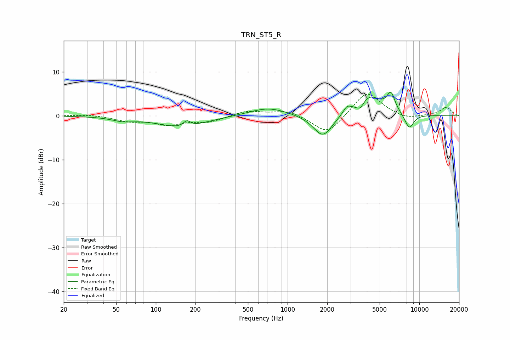

# TRN_ST5_R
See [usage instructions](https://github.com/jaakkopasanen/AutoEq#usage) for more options and info.

### Parametric EQs
Apply preamp of -5.5 dB when using parametric equalizer.

|   # | Type    |   Fc (Hz) |    Q |   Gain (dB) |
|-----|---------|-----------|------|-------------|
|   1 | Peaking |        56 | 1.65 |        -0.8 |
|   2 | Peaking |       157 | 0.81 |        -2.6 |
|   3 | Peaking |       172 | 5.51 |         1.3 |
|   4 | Peaking |       716 | 0.98 |         1.9 |
|   5 | Peaking |      1853 | 1.93 |        -5.2 |
|   6 | Peaking |      2824 | 4.78 |         1.5 |
|   7 | Peaking |      3561 | 4.59 |        -2   |
|   8 | Peaking |      4096 | 1.43 |         4.8 |
|   9 | Peaking |      6090 | 4.37 |         4   |
|  10 | Peaking |      8384 | 3.66 |        -3.4 |

### Fixed Band EQs
When using fixed band (also called graphic) equalizer, apply preamp of **-5.0 dB** (if available) and set gains manually with these parameters.

|   # | Type    |   Fc (Hz) |    Q |   Gain (dB) |
|-----|---------|-----------|------|-------------|
|   1 | Peaking |        31 | 1.41 |         0.3 |
|   2 | Peaking |        62 | 1.41 |        -1.1 |
|   3 | Peaking |       125 | 1.41 |        -1.9 |
|   4 | Peaking |       250 | 1.41 |        -1.3 |
|   5 | Peaking |       500 | 1.41 |         1.2 |
|   6 | Peaking |      1000 | 1.41 |         1.3 |
|   7 | Peaking |      2000 | 1.41 |        -4.4 |
|   8 | Peaking |      4000 | 1.41 |         5.7 |
|   9 | Peaking |      8000 | 1.41 |        -0.9 |
|  10 | Peaking |     16000 | 1.41 |         2   |

### Graphs

