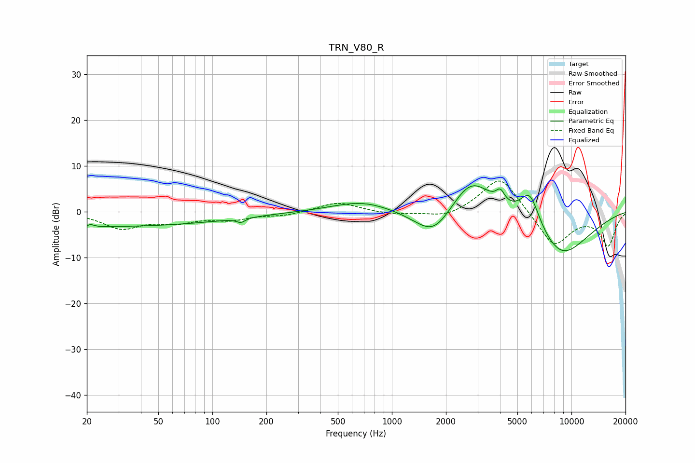

# TRN_V80_R
See [usage instructions](https://github.com/jaakkopasanen/AutoEq#usage) for more options and info.

### Parametric EQs
Apply preamp of -5.7 dB when using parametric equalizer.

|   # | Type    |   Fc (Hz) |    Q |   Gain (dB) |
|-----|---------|-----------|------|-------------|
|   1 | Peaking |        20 | 3.92 |        -2.5 |
|   2 | Peaking |        20 | 4.92 |         2.7 |
|   3 | Peaking |        25 | 0.18 |        -3.2 |
|   4 | Peaking |       144 | 5.95 |        -0.9 |
|   5 | Peaking |       684 | 0.85 |         2.4 |
|   6 | Peaking |      1713 | 1.26 |        -7.2 |
|   7 | Peaking |      2757 | 1.13 |         9.2 |
|   8 | Peaking |      4018 | 6    |         2.5 |
|   9 | Peaking |      5872 | 2.38 |         8.2 |
|  10 | Peaking |      8654 | 0.76 |       -10.3 |

### Fixed Band EQs
When using fixed band (also called graphic) equalizer, apply preamp of **-6.8 dB** (if available) and set gains manually with these parameters.

|   # | Type    |   Fc (Hz) |    Q |   Gain (dB) |
|-----|---------|-----------|------|-------------|
|   1 | Peaking |        31 | 1.41 |        -3.5 |
|   2 | Peaking |        62 | 1.41 |        -1.9 |
|   3 | Peaking |       125 | 1.41 |        -1.5 |
|   4 | Peaking |       250 | 1.41 |        -0.8 |
|   5 | Peaking |       500 | 1.41 |         2.1 |
|   6 | Peaking |      1000 | 1.41 |        -0.7 |
|   7 | Peaking |      2000 | 1.41 |        -1.5 |
|   8 | Peaking |      4000 | 1.41 |         8.2 |
|   9 | Peaking |      8000 | 1.41 |        -7.7 |
|  10 | Peaking |     16000 | 1.41 |        -7.2 |

### Graphs

