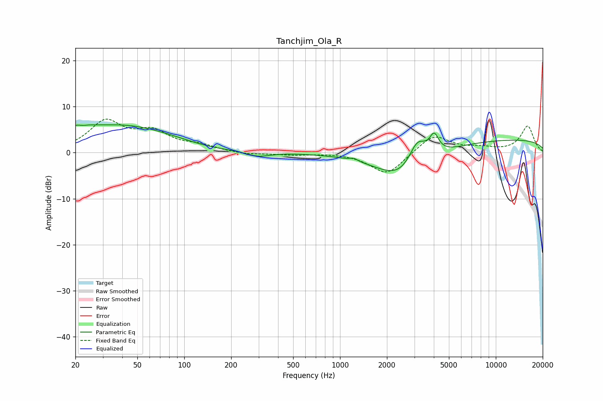

# Tanchjim_Ola_R
See [usage instructions](https://github.com/jaakkopasanen/AutoEq#usage) for more options and info.

### Parametric EQs
Apply preamp of -6.2 dB when using parametric equalizer.

|   # | Type    |   Fc (Hz) |    Q |   Gain (dB) |
|-----|---------|-----------|------|-------------|
|   1 | Peaking |        20 | 1.69 |         1.9 |
|   2 | Peaking |        22 | 5.84 |        -0.3 |
|   3 | Peaking |        40 | 0.41 |         5.8 |
|   4 | Peaking |       138 | 0.9  |        -0.6 |
|   5 | Peaking |       297 | 1.81 |        -1.1 |
|   6 | Peaking |      1225 | 5.74 |         0.5 |
|   7 | Peaking |      2556 | 0.82 |        -7.6 |
|   8 | Peaking |      3134 | 2.37 |         6.1 |
|   9 | Peaking |      4021 | 4.78 |         4   |
|  10 | Peaking |     10000 | 0.18 |         3   |

### Fixed Band EQs
When using fixed band (also called graphic) equalizer, apply preamp of **-7.4 dB** (if available) and set gains manually with these parameters.

|   # | Type    |   Fc (Hz) |    Q |   Gain (dB) |
|-----|---------|-----------|------|-------------|
|   1 | Peaking |        31 | 1.41 |         6.5 |
|   2 | Peaking |        62 | 1.41 |         4   |
|   3 | Peaking |       125 | 1.41 |         1.3 |
|   4 | Peaking |       250 | 1.41 |        -0.5 |
|   5 | Peaking |       500 | 1.41 |        -0.4 |
|   6 | Peaking |      1000 | 1.41 |         0.1 |
|   7 | Peaking |      2000 | 1.41 |        -4.9 |
|   8 | Peaking |      4000 | 1.41 |         4   |
|   9 | Peaking |      8000 | 1.41 |         0.8 |
|  10 | Peaking |     16000 | 1.41 |         5.7 |

### Graphs

