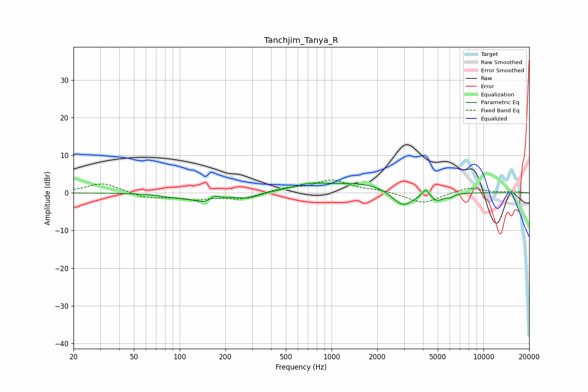

# Tanchjim_Tanya_R
See [usage instructions](https://github.com/jaakkopasanen/AutoEq#usage) for more options and info.

### Parametric EQs
Apply preamp of -2.7 dB when using parametric equalizer.

|   # | Type    |   Fc (Hz) |    Q |   Gain (dB) |
|-----|---------|-----------|------|-------------|
|   1 | Peaking |        89 | 1.54 |        -0.7 |
|   2 | Peaking |       152 | 1.58 |        -2.7 |
|   3 | Peaking |       170 | 4.08 |         1.7 |
|   4 | Peaking |       284 | 2.11 |        -1.3 |
|   5 | Peaking |       710 | 1.24 |         1.6 |
|   6 | Peaking |      1695 | 0.59 |         2.7 |
|   7 | Peaking |      2941 | 1.87 |        -4.8 |
|   8 | Peaking |      4175 | 6    |         2.1 |
|   9 | Peaking |      4953 | 3.16 |        -2.1 |
|  10 | Peaking |      6062 | 5.34 |        -0.8 |

### Fixed Band EQs
When using fixed band (also called graphic) equalizer, apply preamp of **-3.5 dB** (if available) and set gains manually with these parameters.

|   # | Type    |   Fc (Hz) |    Q |   Gain (dB) |
|-----|---------|-----------|------|-------------|
|   1 | Peaking |        31 | 1.41 |         2.7 |
|   2 | Peaking |        62 | 1.41 |        -1.4 |
|   3 | Peaking |       125 | 1.41 |        -1.5 |
|   4 | Peaking |       250 | 1.41 |        -1.6 |
|   5 | Peaking |       500 | 1.41 |         1.1 |
|   6 | Peaking |      1000 | 1.41 |         3.3 |
|   7 | Peaking |      2000 | 1.41 |         0.7 |
|   8 | Peaking |      4000 | 1.41 |        -2.9 |
|   9 | Peaking |      8000 | 1.41 |         1.5 |
|  10 | Peaking |     16000 | 1.41 |         0.4 |

### Graphs

