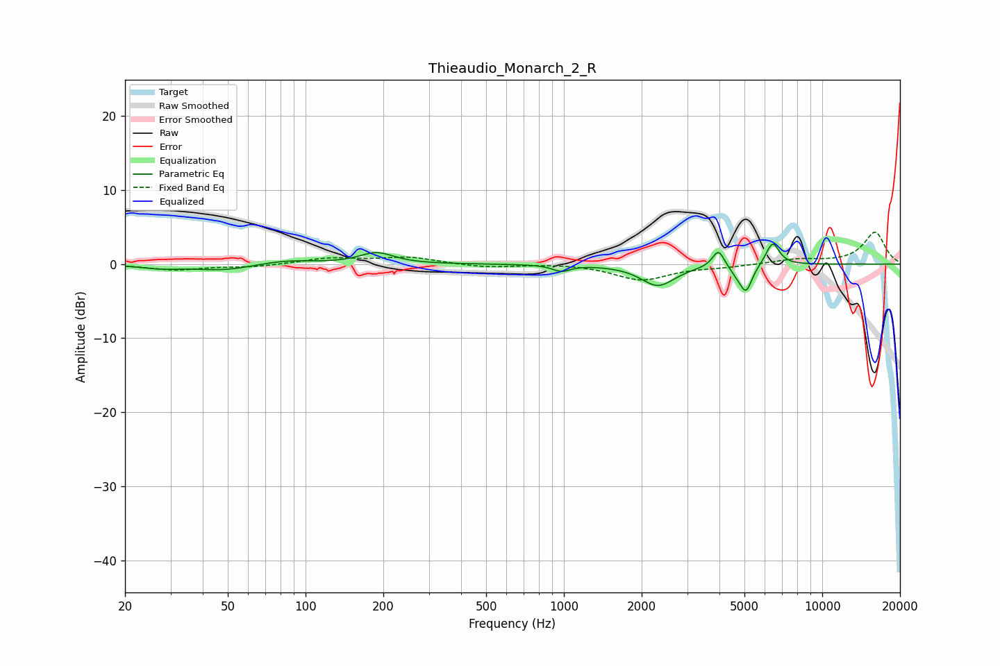

# Thieaudio_Monarch_2_R
See [usage instructions](https://github.com/jaakkopasanen/AutoEq#usage) for more options and info.

### Parametric EQs
Apply preamp of -2.8 dB when using parametric equalizer.

|   # | Type    |   Fc (Hz) |    Q |   Gain (dB) |
|-----|---------|-----------|------|-------------|
|   1 | Peaking |        27 | 1.92 |        -0.5 |
|   2 | Peaking |        48 | 1.2  |        -0.9 |
|   3 | Peaking |        83 | 1.28 |         0.6 |
|   4 | Peaking |       188 | 2.19 |         1.5 |
|   5 | Peaking |       977 | 4.24 |        -0.8 |
|   6 | Peaking |      2313 | 2.14 |        -2.9 |
|   7 | Peaking |      3968 | 6    |         2.5 |
|   8 | Peaking |      4705 | 4.04 |        -0.9 |
|   9 | Peaking |      5074 | 5.96 |        -3.3 |
|  10 | Peaking |      6424 | 5.29 |         3.1 |

### Fixed Band EQs
When using fixed band (also called graphic) equalizer, apply preamp of **-4.4 dB** (if available) and set gains manually with these parameters.

|   # | Type    |   Fc (Hz) |    Q |   Gain (dB) |
|-----|---------|-----------|------|-------------|
|   1 | Peaking |        31 | 1.41 |        -0.8 |
|   2 | Peaking |        62 | 1.41 |        -0.4 |
|   3 | Peaking |       125 | 1.41 |         0.8 |
|   4 | Peaking |       250 | 1.41 |         0.9 |
|   5 | Peaking |       500 | 1.41 |        -0.5 |
|   6 | Peaking |      1000 | 1.41 |         0.1 |
|   7 | Peaking |      2000 | 1.41 |        -2.1 |
|   8 | Peaking |      4000 | 1.41 |        -0.3 |
|   9 | Peaking |      8000 | 1.41 |         0.6 |
|  10 | Peaking |     16000 | 1.41 |         4.3 |

### Graphs

