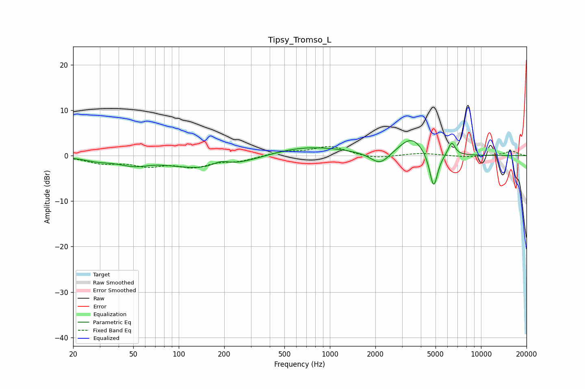

# Tipsy_Tromso_L
See [usage instructions](https://github.com/jaakkopasanen/AutoEq#usage) for more options and info.

### Parametric EQs
Apply preamp of -3.4 dB when using parametric equalizer.

|   # | Type    |   Fc (Hz) |    Q |   Gain (dB) |
|-----|---------|-----------|------|-------------|
|   1 | Peaking |        29 | 1.63 |        -0.7 |
|   2 | Peaking |        52 | 1.25 |        -1.7 |
|   3 | Peaking |        66 | 1.55 |         0.4 |
|   4 | Peaking |       170 | 0.54 |        -3.3 |
|   5 | Peaking |       190 | 2.41 |         1.4 |
|   6 | Peaking |       674 | 0.52 |         2.3 |
|   7 | Peaking |      2148 | 2.24 |        -2.9 |
|   8 | Peaking |      3468 | 1.67 |         4.1 |
|   9 | Peaking |      4860 | 5.08 |        -8.2 |
|  10 | Peaking |      6391 | 6    |         2.9 |

### Fixed Band EQs
When using fixed band (also called graphic) equalizer, apply preamp of **-2.1 dB** (if available) and set gains manually with these parameters.

|   # | Type    |   Fc (Hz) |    Q |   Gain (dB) |
|-----|---------|-----------|------|-------------|
|   1 | Peaking |        31 | 1.41 |        -1.5 |
|   2 | Peaking |        62 | 1.41 |        -1.9 |
|   3 | Peaking |       125 | 1.41 |        -2.2 |
|   4 | Peaking |       250 | 1.41 |        -1   |
|   5 | Peaking |       500 | 1.41 |         0.9 |
|   6 | Peaking |      1000 | 1.41 |         2   |
|   7 | Peaking |      2000 | 1.41 |        -0.7 |
|   8 | Peaking |      4000 | 1.41 |         0.6 |
|   9 | Peaking |      8000 | 1.41 |        -0.3 |
|  10 | Peaking |     16000 | 1.41 |         1   |

### Graphs

