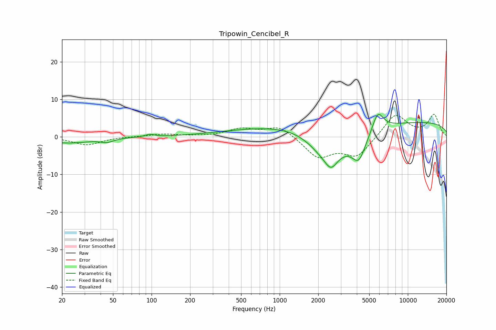

# Tripowin_Cencibel_R
See [usage instructions](https://github.com/jaakkopasanen/AutoEq#usage) for more options and info.

### Parametric EQs
Apply preamp of -6.1 dB when using parametric equalizer.

|   # | Type    |   Fc (Hz) |    Q |   Gain (dB) |
|-----|---------|-----------|------|-------------|
|   1 | Peaking |        22 | 0.77 |        -1.6 |
|   2 | Peaking |        45 | 3.04 |        -0.9 |
|   3 | Peaking |        97 | 4.12 |         0.7 |
|   4 | Peaking |       813 | 0.39 |         2.2 |
|   5 | Peaking |      1530 | 0.68 |         2.1 |
|   6 | Peaking |      2366 | 0.87 |        -9.3 |
|   7 | Peaking |      2516 | 3.19 |        -3.1 |
|   8 | Peaking |      4149 | 2.49 |        -6.7 |
|   9 | Peaking |      5833 | 3.14 |         5.3 |
|  10 | Peaking |     10000 | 0.18 |         4.1 |

### Fixed Band EQs
When using fixed band (also called graphic) equalizer, apply preamp of **-6.1 dB** (if available) and set gains manually with these parameters.

|   # | Type    |   Fc (Hz) |    Q |   Gain (dB) |
|-----|---------|-----------|------|-------------|
|   1 | Peaking |        31 | 1.41 |        -2.1 |
|   2 | Peaking |        62 | 1.41 |         0.1 |
|   3 | Peaking |       125 | 1.41 |         0.7 |
|   4 | Peaking |       250 | 1.41 |         0.1 |
|   5 | Peaking |       500 | 1.41 |         2   |
|   6 | Peaking |      1000 | 1.41 |         3   |
|   7 | Peaking |      2000 | 1.41 |        -5.4 |
|   8 | Peaking |      4000 | 1.41 |        -5.2 |
|   9 | Peaking |      8000 | 1.41 |         6.3 |
|  10 | Peaking |     16000 | 1.41 |         5.8 |

### Graphs

