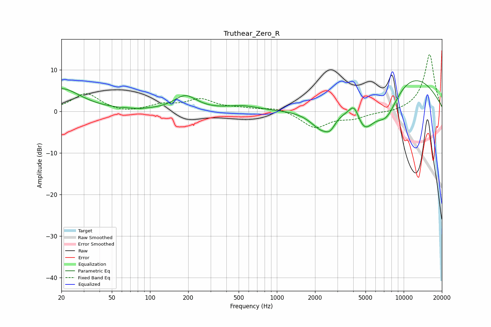

# Truthear_Zero_R
See [usage instructions](https://github.com/jaakkopasanen/AutoEq#usage) for more options and info.

### Parametric EQs
Apply preamp of -7.4 dB when using parametric equalizer.

|   # | Type    |   Fc (Hz) |    Q |   Gain (dB) |
|-----|---------|-----------|------|-------------|
|   1 | Peaking |        20 | 0.94 |         5.4 |
|   2 | Peaking |        83 | 4.82 |        -0.1 |
|   3 | Peaking |       190 | 1.56 |         3.6 |
|   4 | Peaking |       537 | 1.13 |         1.1 |
|   5 | Peaking |      2290 | 1.51 |        -5.4 |
|   6 | Peaking |      2646 | 3.94 |        -1.7 |
|   7 | Peaking |      4073 | 3.62 |         3.4 |
|   8 | Peaking |      4891 | 1.75 |        -7.1 |
|   9 | Peaking |      7310 | 1.28 |        -8.3 |
|  10 | Peaking |      9945 | 0.36 |        10   |

### Fixed Band EQs
When using fixed band (also called graphic) equalizer, apply preamp of **-13.7 dB** (if available) and set gains manually with these parameters.

|   # | Type    |   Fc (Hz) |    Q |   Gain (dB) |
|-----|---------|-----------|------|-------------|
|   1 | Peaking |        31 | 1.41 |         4.3 |
|   2 | Peaking |        62 | 1.41 |        -0.6 |
|   3 | Peaking |       125 | 1.41 |         1.4 |
|   4 | Peaking |       250 | 1.41 |         2.7 |
|   5 | Peaking |       500 | 1.41 |         0.6 |
|   6 | Peaking |      1000 | 1.41 |         1   |
|   7 | Peaking |      2000 | 1.41 |        -3.9 |
|   8 | Peaking |      4000 | 1.41 |        -1.5 |
|   9 | Peaking |      8000 | 1.41 |        -0.4 |
|  10 | Peaking |     16000 | 1.41 |        13.8 |

### Graphs

