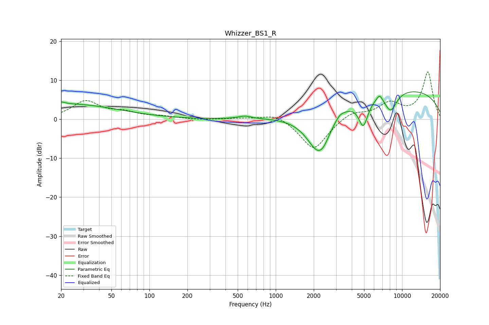

# Whizzer_BS1_R
See [usage instructions](https://github.com/jaakkopasanen/AutoEq#usage) for more options and info.

### Parametric EQs
Apply preamp of -7.2 dB when using parametric equalizer.

|   # | Type    |   Fc (Hz) |    Q |   Gain (dB) |
|-----|---------|-----------|------|-------------|
|   1 | Peaking |        20 | 5.53 |         0.5 |
|   2 | Peaking |        22 | 0.33 |         3.9 |
|   3 | Peaking |       569 | 2.73 |         0.7 |
|   4 | Peaking |      2140 | 1.4  |       -10.3 |
|   5 | Peaking |      2392 | 2.86 |        -2.2 |
|   6 | Peaking |      3218 | 4.53 |         0.8 |
|   7 | Peaking |      4934 | 3.65 |        -6.9 |
|   8 | Peaking |      6641 | 5.61 |         1.7 |
|   9 | Peaking |      8123 | 2.65 |        -5   |
|  10 | Peaking |      9066 | 0.21 |         8   |

### Fixed Band EQs
When using fixed band (also called graphic) equalizer, apply preamp of **-12.2 dB** (if available) and set gains manually with these parameters.

|   # | Type    |   Fc (Hz) |    Q |   Gain (dB) |
|-----|---------|-----------|------|-------------|
|   1 | Peaking |        31 | 1.41 |         4.5 |
|   2 | Peaking |        62 | 1.41 |         1.5 |
|   3 | Peaking |       125 | 1.41 |         0.6 |
|   4 | Peaking |       250 | 1.41 |        -0.2 |
|   5 | Peaking |       500 | 1.41 |         0.3 |
|   6 | Peaking |      1000 | 1.41 |         1.8 |
|   7 | Peaking |      2000 | 1.41 |        -8   |
|   8 | Peaking |      4000 | 1.41 |         2.1 |
|   9 | Peaking |      8000 | 1.41 |         3.8 |
|  10 | Peaking |     16000 | 1.41 |        12.1 |

### Graphs

