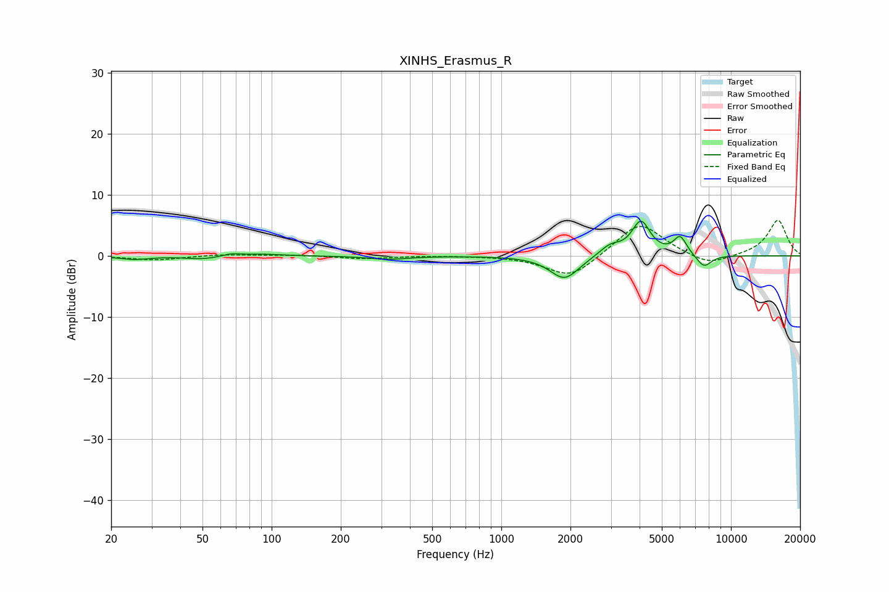

# XINHS_Erasmus_R
See [usage instructions](https://github.com/jaakkopasanen/AutoEq#usage) for more options and info.

### Parametric EQs
Apply preamp of -5.8 dB when using parametric equalizer.

|   # | Type    |   Fc (Hz) |    Q |   Gain (dB) |
|-----|---------|-----------|------|-------------|
|   1 | Peaking |        25 | 2.18 |        -0.6 |
|   2 | Peaking |        50 | 1.99 |        -0.5 |
|   3 | Peaking |        67 | 3.95 |         0.4 |
|   4 | Peaking |        90 | 1.61 |         0.3 |
|   5 | Peaking |       322 | 1.65 |        -0.5 |
|   6 | Peaking |      1884 | 2.24 |        -3.8 |
|   7 | Peaking |      2975 | 3.05 |         1.6 |
|   8 | Peaking |      4055 | 3.45 |         5.5 |
|   9 | Peaking |      6008 | 4.86 |         3   |
|  10 | Peaking |      7628 | 4.03 |        -2.1 |

### Fixed Band EQs
When using fixed band (also called graphic) equalizer, apply preamp of **-5.9 dB** (if available) and set gains manually with these parameters.

|   # | Type    |   Fc (Hz) |    Q |   Gain (dB) |
|-----|---------|-----------|------|-------------|
|   1 | Peaking |        31 | 1.41 |        -0.7 |
|   2 | Peaking |        62 | 1.41 |         0.3 |
|   3 | Peaking |       125 | 1.41 |         0.2 |
|   4 | Peaking |       250 | 1.41 |        -0.5 |
|   5 | Peaking |       500 | 1.41 |         0   |
|   6 | Peaking |      1000 | 1.41 |         0   |
|   7 | Peaking |      2000 | 1.41 |        -3.8 |
|   8 | Peaking |      4000 | 1.41 |         5.7 |
|   9 | Peaking |      8000 | 1.41 |        -1.8 |
|  10 | Peaking |     16000 | 1.41 |         5.9 |

### Graphs

