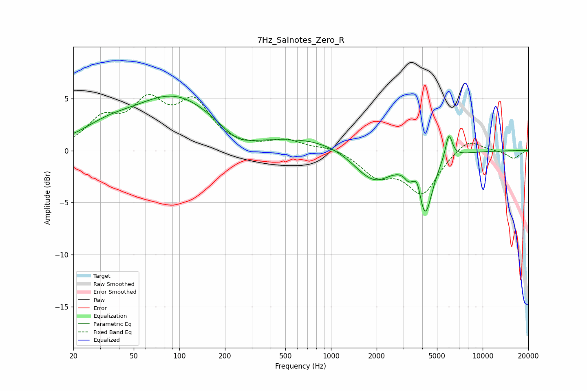

# 7Hz_Salnotes_Zero_R
See [usage instructions](https://github.com/jaakkopasanen/AutoEq#usage) for more options and info.

### Parametric EQs
Apply preamp of -5.3 dB when using parametric equalizer.

|   # | Type    |   Fc (Hz) |    Q |   Gain (dB) |
|-----|---------|-----------|------|-------------|
|   1 | Peaking |        33 | 0.81 |         1.4 |
|   2 | Peaking |        94 | 0.51 |         5   |
|   3 | Peaking |       241 | 1.33 |        -1.3 |
|   4 | Peaking |       750 | 0.66 |         1   |
|   5 | Peaking |      1569 | 1.54 |        -0.3 |
|   6 | Peaking |      1959 | 1.18 |        -2.7 |
|   7 | Peaking |      3237 | 5.47 |        -0.6 |
|   8 | Peaking |      3727 | 6    |         1.5 |
|   9 | Peaking |      4160 | 2.88 |        -5.9 |
|  10 | Peaking |      5990 | 6    |         2.4 |

### Fixed Band EQs
When using fixed band (also called graphic) equalizer, apply preamp of **-5.5 dB** (if available) and set gains manually with these parameters.

|   # | Type    |   Fc (Hz) |    Q |   Gain (dB) |
|-----|---------|-----------|------|-------------|
|   1 | Peaking |        31 | 1.41 |         2.7 |
|   2 | Peaking |        62 | 1.41 |         4.1 |
|   3 | Peaking |       125 | 1.41 |         4.2 |
|   4 | Peaking |       250 | 1.41 |         0.1 |
|   5 | Peaking |       500 | 1.41 |         0.9 |
|   6 | Peaking |      1000 | 1.41 |         0.4 |
|   7 | Peaking |      2000 | 1.41 |        -2.2 |
|   8 | Peaking |      4000 | 1.41 |        -4   |
|   9 | Peaking |      8000 | 1.41 |         1.3 |
|  10 | Peaking |     16000 | 1.41 |        -0.8 |

### Graphs

