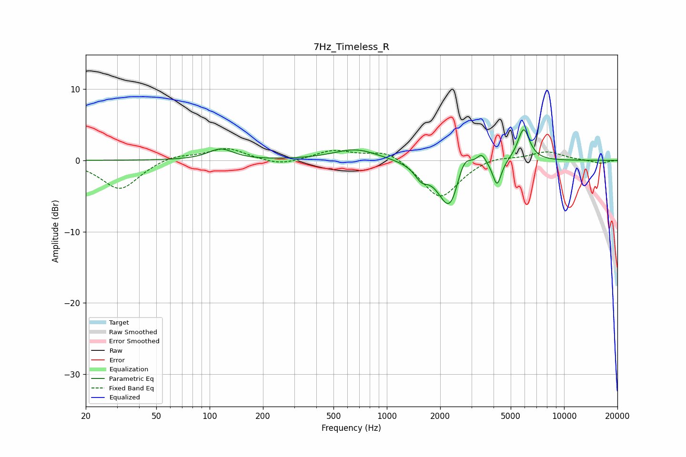

# 7Hz_Timeless_R
See [usage instructions](https://github.com/jaakkopasanen/AutoEq#usage) for more options and info.

### Parametric EQs
Apply preamp of -4.4 dB when using parametric equalizer.

|   # | Type    |   Fc (Hz) |    Q |   Gain (dB) |
|-----|---------|-----------|------|-------------|
|   1 | Peaking |       116 | 1.99 |         1.5 |
|   2 | Peaking |       669 | 1.1  |         1.6 |
|   3 | Peaking |      1566 | 3.87 |        -1.6 |
|   4 | Peaking |      2289 | 2.25 |        -6.2 |
|   5 | Peaking |      2419 | 1.69 |        -2.5 |
|   6 | Peaking |      2635 | 2.63 |         1.9 |
|   7 | Peaking |      2710 | 2.92 |         3.2 |
|   8 | Peaking |      3425 | 5.39 |         1.6 |
|   9 | Peaking |      4189 | 6    |        -3.4 |
|  10 | Peaking |      5912 | 4.03 |         4.6 |

### Fixed Band EQs
When using fixed band (also called graphic) equalizer, apply preamp of **-1.7 dB** (if available) and set gains manually with these parameters.

|   # | Type    |   Fc (Hz) |    Q |   Gain (dB) |
|-----|---------|-----------|------|-------------|
|   1 | Peaking |        31 | 1.41 |        -4.1 |
|   2 | Peaking |        62 | 1.41 |         0.8 |
|   3 | Peaking |       125 | 1.41 |         1.7 |
|   4 | Peaking |       250 | 1.41 |        -0.8 |
|   5 | Peaking |       500 | 1.41 |         1.4 |
|   6 | Peaking |      1000 | 1.41 |         1.6 |
|   7 | Peaking |      2000 | 1.41 |        -5.5 |
|   8 | Peaking |      4000 | 1.41 |         0.7 |
|   9 | Peaking |      8000 | 1.41 |         1.2 |
|  10 | Peaking |     16000 | 1.41 |        -0.5 |

### Graphs

