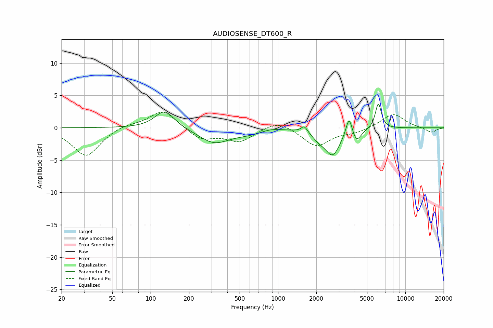

# AUDIOSENSE_DT600_R
See [usage instructions](https://github.com/jaakkopasanen/AutoEq#usage) for more options and info.

### Parametric EQs
Apply preamp of -3.8 dB when using parametric equalizer.

|   # | Type    |   Fc (Hz) |    Q |   Gain (dB) |
|-----|---------|-----------|------|-------------|
|   1 | Peaking |       129 | 1.89 |         2.8 |
|   2 | Peaking |       314 | 1.21 |        -2.2 |
|   3 | Peaking |       600 | 0.98 |        -0.8 |
|   4 | Peaking |       873 | 1.75 |         0.5 |
|   5 | Peaking |      1609 | 5.99 |         1   |
|   6 | Peaking |      2082 | 3.17 |        -0.9 |
|   7 | Peaking |      2681 | 2.35 |        -4.1 |
|   8 | Peaking |      3617 | 5.81 |         3.1 |
|   9 | Peaking |      4137 | 4.12 |        -1.9 |
|  10 | Peaking |      6136 | 5.85 |         3.9 |

### Fixed Band EQs
When using fixed band (also called graphic) equalizer, apply preamp of **-2.5 dB** (if available) and set gains manually with these parameters.

|   # | Type    |   Fc (Hz) |    Q |   Gain (dB) |
|-----|---------|-----------|------|-------------|
|   1 | Peaking |        31 | 1.41 |        -4.4 |
|   2 | Peaking |        62 | 1.41 |         0.6 |
|   3 | Peaking |       125 | 1.41 |         2.8 |
|   4 | Peaking |       250 | 1.41 |        -1.8 |
|   5 | Peaking |       500 | 1.41 |        -2   |
|   6 | Peaking |      1000 | 1.41 |         1.3 |
|   7 | Peaking |      2000 | 1.41 |        -2.8 |
|   8 | Peaking |      4000 | 1.41 |        -0.7 |
|   9 | Peaking |      8000 | 1.41 |         2.2 |
|  10 | Peaking |     16000 | 1.41 |        -0.8 |

### Graphs

