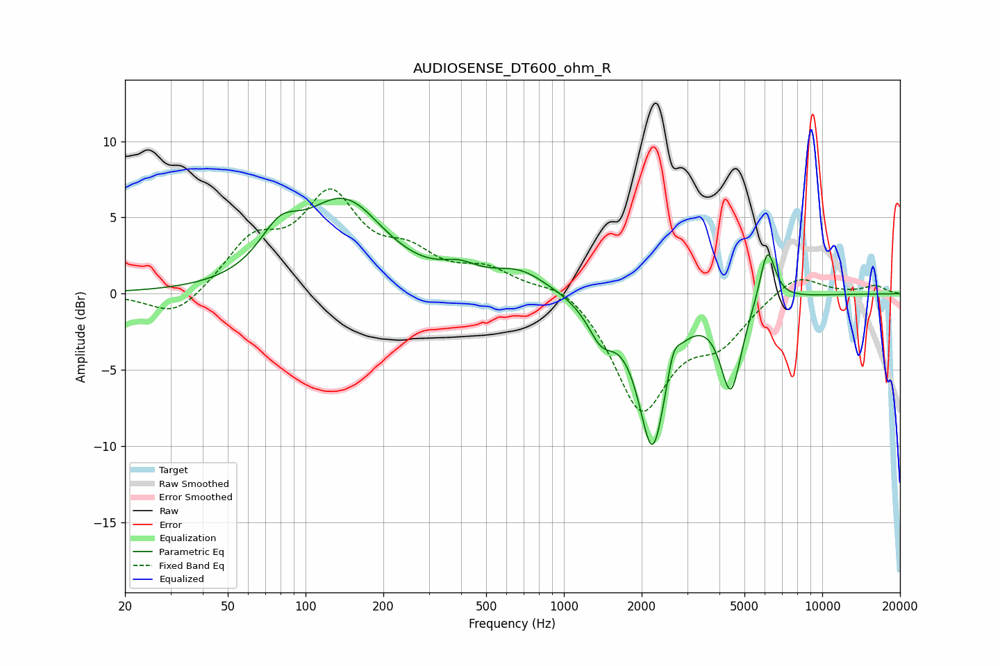

# AUDIOSENSE_DT600_ohm_R
See [usage instructions](https://github.com/jaakkopasanen/AutoEq#usage) for more options and info.

### Parametric EQs
Apply preamp of -6.4 dB when using parametric equalizer.

|   # | Type    |   Fc (Hz) |    Q |   Gain (dB) |
|-----|---------|-----------|------|-------------|
|   1 | Peaking |        80 | 1.78 |         2.6 |
|   2 | Peaking |       142 | 0.99 |         6.5 |
|   3 | Peaking |       143 | 1.66 |        -0.8 |
|   4 | Peaking |       394 | 1.96 |         0.9 |
|   5 | Peaking |       676 | 1.32 |         1.4 |
|   6 | Peaking |      1396 | 2.68 |        -2.2 |
|   7 | Peaking |      2203 | 2.55 |        -9.8 |
|   8 | Peaking |      2652 | 5.99 |         1.5 |
|   9 | Peaking |      4431 | 3.42 |        -5.9 |
|  10 | Peaking |      6138 | 4.58 |         3.7 |

### Fixed Band EQs
When using fixed band (also called graphic) equalizer, apply preamp of **-7.0 dB** (if available) and set gains manually with these parameters.

|   # | Type    |   Fc (Hz) |    Q |   Gain (dB) |
|-----|---------|-----------|------|-------------|
|   1 | Peaking |        31 | 1.41 |        -1.7 |
|   2 | Peaking |        62 | 1.41 |         3.1 |
|   3 | Peaking |       125 | 1.41 |         5.9 |
|   4 | Peaking |       250 | 1.41 |         2.1 |
|   5 | Peaking |       500 | 1.41 |         1.4 |
|   6 | Peaking |      1000 | 1.41 |         1   |
|   7 | Peaking |      2000 | 1.41 |        -7.5 |
|   8 | Peaking |      4000 | 1.41 |        -2.6 |
|   9 | Peaking |      8000 | 1.41 |         1.4 |
|  10 | Peaking |     16000 | 1.41 |         0.5 |

### Graphs

