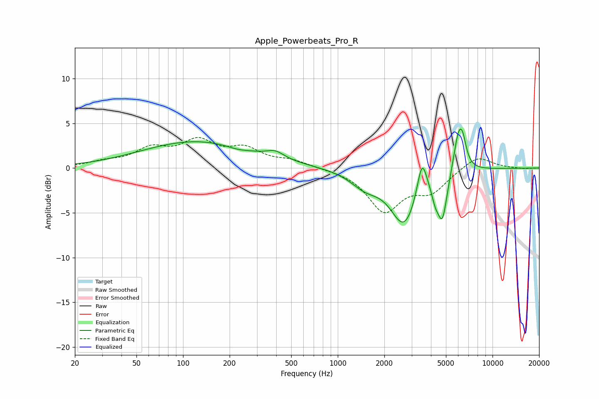

# Apple_Powerbeats_Pro_R
See [usage instructions](https://github.com/jaakkopasanen/AutoEq#usage) for more options and info.

### Parametric EQs
Apply preamp of -4.5 dB when using parametric equalizer.

|   # | Type    |   Fc (Hz) |    Q |   Gain (dB) |
|-----|---------|-----------|------|-------------|
|   1 | Peaking |       123 | 0.39 |         3   |
|   2 | Peaking |       225 | 1.94 |        -0.3 |
|   3 | Peaking |       395 | 2.55 |         0.8 |
|   4 | Peaking |      1503 | 1.47 |        -1.6 |
|   5 | Peaking |      2689 | 1.6  |        -6.1 |
|   6 | Peaking |      3505 | 4.53 |         4.1 |
|   7 | Peaking |      4266 | 5.98 |        -1.5 |
|   8 | Peaking |      4743 | 4.51 |        -5   |
|   9 | Peaking |      6036 | 4.28 |         4.4 |
|  10 | Peaking |      6441 | 6    |         1.8 |

### Fixed Band EQs
When using fixed band (also called graphic) equalizer, apply preamp of **-3.5 dB** (if available) and set gains manually with these parameters.

|   # | Type    |   Fc (Hz) |    Q |   Gain (dB) |
|-----|---------|-----------|------|-------------|
|   1 | Peaking |        31 | 1.41 |         0.5 |
|   2 | Peaking |        62 | 1.41 |         1.9 |
|   3 | Peaking |       125 | 1.41 |         2.7 |
|   4 | Peaking |       250 | 1.41 |         1.9 |
|   5 | Peaking |       500 | 1.41 |         0.7 |
|   6 | Peaking |      1000 | 1.41 |        -0   |
|   7 | Peaking |      2000 | 1.41 |        -4.7 |
|   8 | Peaking |      4000 | 1.41 |        -2.4 |
|   9 | Peaking |      8000 | 1.41 |         1.5 |
|  10 | Peaking |     16000 | 1.41 |        -0.1 |

### Graphs

