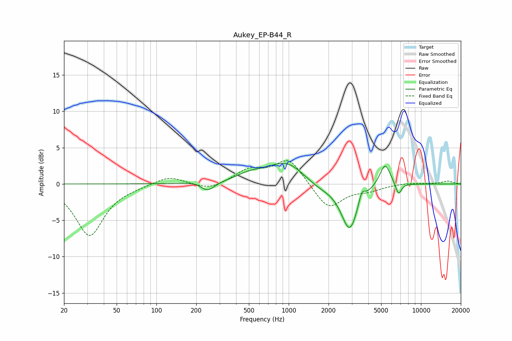

# Aukey_EP-B44_R
See [usage instructions](https://github.com/jaakkopasanen/AutoEq#usage) for more options and info.

### Parametric EQs
Apply preamp of -2.9 dB when using parametric equalizer.

|   # | Type    |   Fc (Hz) |    Q |   Gain (dB) |
|-----|---------|-----------|------|-------------|
|   1 | Peaking |       222 | 1.69 |         0.6 |
|   2 | Peaking |       242 | 2.62 |        -1.1 |
|   3 | Peaking |       242 | 2.3  |        -0.6 |
|   4 | Peaking |       502 | 1.44 |         0.9 |
|   5 | Peaking |       968 | 0.96 |         3.2 |
|   6 | Peaking |      1656 | 1.13 |        -1.1 |
|   7 | Peaking |      2891 | 2.22 |        -6.4 |
|   8 | Peaking |      3563 | 6    |         1.7 |
|   9 | Peaking |      5352 | 3.39 |         3.1 |
|  10 | Peaking |      6759 | 6    |        -1.7 |

### Fixed Band EQs
When using fixed band (also called graphic) equalizer, apply preamp of **-3.3 dB** (if available) and set gains manually with these parameters.

|   # | Type    |   Fc (Hz) |    Q |   Gain (dB) |
|-----|---------|-----------|------|-------------|
|   1 | Peaking |        31 | 1.41 |        -7.1 |
|   2 | Peaking |        62 | 1.41 |        -0.2 |
|   3 | Peaking |       125 | 1.41 |         1.1 |
|   4 | Peaking |       250 | 1.41 |        -0.9 |
|   5 | Peaking |       500 | 1.41 |         1.8 |
|   6 | Peaking |      1000 | 1.41 |         3.5 |
|   7 | Peaking |      2000 | 1.41 |        -3.5 |
|   8 | Peaking |      4000 | 1.41 |        -0.7 |
|   9 | Peaking |      8000 | 1.41 |         0.2 |
|  10 | Peaking |     16000 | 1.41 |         0.4 |

### Graphs

