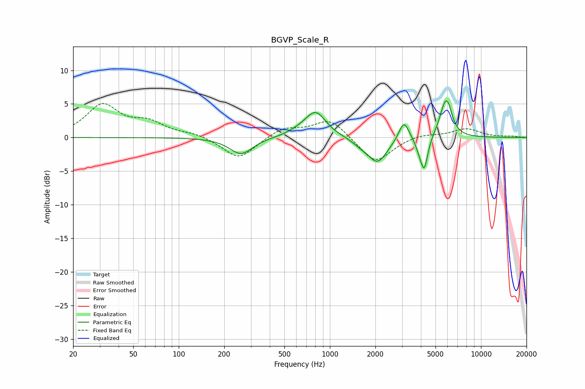

# BGVP_Scale_R
See [usage instructions](https://github.com/jaakkopasanen/AutoEq#usage) for more options and info.

### Parametric EQs
Apply preamp of -5.6 dB when using parametric equalizer.

|   # | Type    |   Fc (Hz) |    Q |   Gain (dB) |
|-----|---------|-----------|------|-------------|
|   1 | Peaking |       258 | 1.87 |        -2.5 |
|   2 | Peaking |       640 | 1.77 |         0.6 |
|   3 | Peaking |       807 | 2.07 |         3.6 |
|   4 | Peaking |      1581 | 2.84 |        -0.5 |
|   5 | Peaking |      2065 | 2.16 |        -3.7 |
|   6 | Peaking |      3091 | 4.17 |         3   |
|   7 | Peaking |      3895 | 5.4  |        -1.1 |
|   8 | Peaking |      4210 | 5.94 |        -4.7 |
|   9 | Peaking |      5780 | 3.69 |         4.6 |
|  10 | Peaking |      6112 | 5.33 |         1.5 |

### Fixed Band EQs
When using fixed band (also called graphic) equalizer, apply preamp of **-5.2 dB** (if available) and set gains manually with these parameters.

|   # | Type    |   Fc (Hz) |    Q |   Gain (dB) |
|-----|---------|-----------|------|-------------|
|   1 | Peaking |        31 | 1.41 |         4.7 |
|   2 | Peaking |        62 | 1.41 |         1.9 |
|   3 | Peaking |       125 | 1.41 |         0.6 |
|   4 | Peaking |       250 | 1.41 |        -3.3 |
|   5 | Peaking |       500 | 1.41 |         1.5 |
|   6 | Peaking |      1000 | 1.41 |         2.8 |
|   7 | Peaking |      2000 | 1.41 |        -3.9 |
|   8 | Peaking |      4000 | 1.41 |         0.6 |
|   9 | Peaking |      8000 | 1.41 |         1.3 |
|  10 | Peaking |     16000 | 1.41 |         0.2 |

### Graphs

