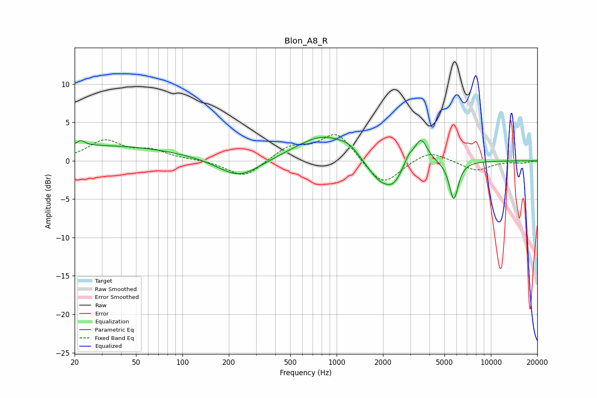

# Blon_A8_R
See [usage instructions](https://github.com/jaakkopasanen/AutoEq#usage) for more options and info.

### Parametric EQs
Apply preamp of -3.2 dB when using parametric equalizer.

|   # | Type    |   Fc (Hz) |    Q |   Gain (dB) |
|-----|---------|-----------|------|-------------|
|   1 | Peaking |        22 | 5.61 |         0.7 |
|   2 | Peaking |        28 | 0.25 |         2   |
|   3 | Peaking |       233 | 1.05 |        -2.5 |
|   4 | Peaking |       831 | 0.78 |         3.5 |
|   5 | Peaking |      1220 | 2.34 |         0.8 |
|   6 | Peaking |      1986 | 1.38 |        -3.8 |
|   7 | Peaking |      2363 | 3.27 |        -1.1 |
|   8 | Peaking |      2938 | 4.77 |         1.1 |
|   9 | Peaking |      3521 | 3.24 |         3.3 |
|  10 | Peaking |      5746 | 4.71 |        -5   |

### Fixed Band EQs
When using fixed band (also called graphic) equalizer, apply preamp of **-3.5 dB** (if available) and set gains manually with these parameters.

|   # | Type    |   Fc (Hz) |    Q |   Gain (dB) |
|-----|---------|-----------|------|-------------|
|   1 | Peaking |        31 | 1.41 |         2.5 |
|   2 | Peaking |        62 | 1.41 |         1.2 |
|   3 | Peaking |       125 | 1.41 |         0.1 |
|   4 | Peaking |       250 | 1.41 |        -2.3 |
|   5 | Peaking |       500 | 1.41 |         1.8 |
|   6 | Peaking |      1000 | 1.41 |         3.7 |
|   7 | Peaking |      2000 | 1.41 |        -3.4 |
|   8 | Peaking |      4000 | 1.41 |         1.4 |
|   9 | Peaking |      8000 | 1.41 |        -1.3 |
|  10 | Peaking |     16000 | 1.41 |        -0.3 |

### Graphs

