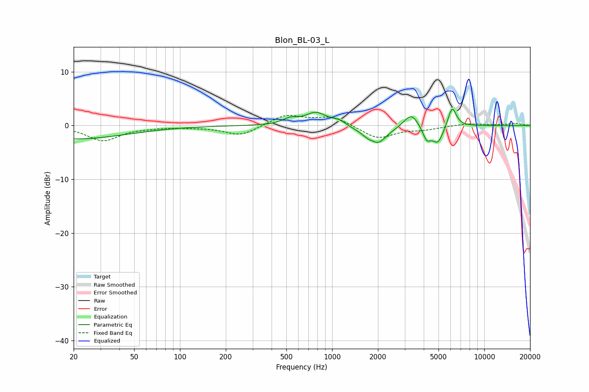

# Blon_BL-03_L
See [usage instructions](https://github.com/jaakkopasanen/AutoEq#usage) for more options and info.

### Parametric EQs
Apply preamp of -3.1 dB when using parametric equalizer.

|   # | Type    |   Fc (Hz) |    Q |   Gain (dB) |
|-----|---------|-----------|------|-------------|
|   1 | Peaking |        20 | 0.4  |        -2.5 |
|   2 | Peaking |       529 | 2.92 |         1   |
|   3 | Peaking |       784 | 1.98 |         2.4 |
|   4 | Peaking |      1109 | 3.32 |         0.8 |
|   5 | Peaking |      1858 | 5.99 |         0.6 |
|   6 | Peaking |      1923 | 2.13 |        -3.9 |
|   7 | Peaking |      3306 | 3.01 |         2.6 |
|   8 | Peaking |      4185 | 5.25 |        -2.4 |
|   9 | Peaking |      4950 | 3.72 |        -3.3 |
|  10 | Peaking |      6145 | 4.98 |         3.8 |

### Fixed Band EQs
When using fixed band (also called graphic) equalizer, apply preamp of **-2.0 dB** (if available) and set gains manually with these parameters.

|   # | Type    |   Fc (Hz) |    Q |   Gain (dB) |
|-----|---------|-----------|------|-------------|
|   1 | Peaking |        31 | 1.41 |        -2.8 |
|   2 | Peaking |        62 | 1.41 |        -0.2 |
|   3 | Peaking |       125 | 1.41 |        -0.2 |
|   4 | Peaking |       250 | 1.41 |        -1.9 |
|   5 | Peaking |       500 | 1.41 |         2   |
|   6 | Peaking |      1000 | 1.41 |         1.7 |
|   7 | Peaking |      2000 | 1.41 |        -2.4 |
|   8 | Peaking |      4000 | 1.41 |        -0.6 |
|   9 | Peaking |      8000 | 1.41 |         0.4 |
|  10 | Peaking |     16000 | 1.41 |         0.4 |

### Graphs

