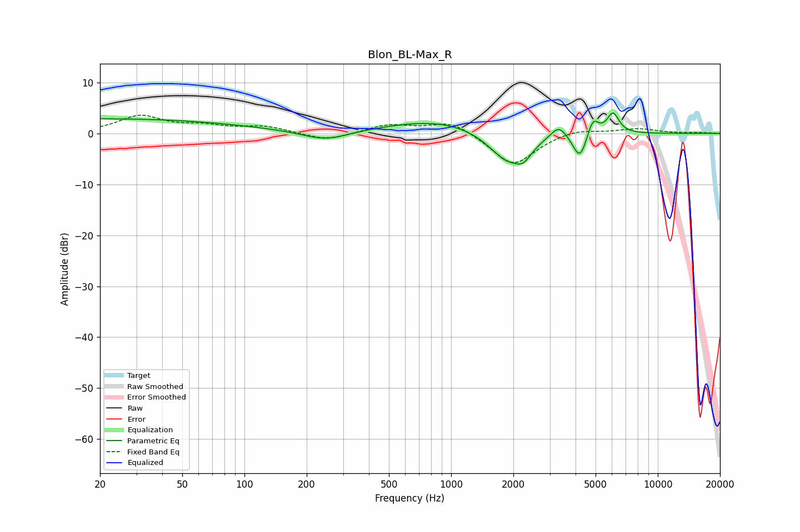

# Blon_BL-Max_R
See [usage instructions](https://github.com/jaakkopasanen/AutoEq#usage) for more options and info.

### Parametric EQs
Apply preamp of -4.1 dB when using parametric equalizer.

|   # | Type    |   Fc (Hz) |    Q |   Gain (dB) |
|-----|---------|-----------|------|-------------|
|   1 | Peaking |        20 | 0.19 |         2.9 |
|   2 | Peaking |       247 | 1.27 |        -2   |
|   3 | Peaking |       888 | 0.56 |         2.8 |
|   4 | Peaking |      1875 | 1.5  |        -6.2 |
|   5 | Peaking |      2244 | 3.65 |        -2.3 |
|   6 | Peaking |      3321 | 3.56 |         2.7 |
|   7 | Peaking |      4209 | 4.1  |        -5.7 |
|   8 | Peaking |      4250 | 5.89 |         0.3 |
|   9 | Peaking |      4847 | 5.08 |         3.7 |
|  10 | Peaking |      6074 | 4.76 |         4   |

### Fixed Band EQs
When using fixed band (also called graphic) equalizer, apply preamp of **-3.7 dB** (if available) and set gains manually with these parameters.

|   # | Type    |   Fc (Hz) |    Q |   Gain (dB) |
|-----|---------|-----------|------|-------------|
|   1 | Peaking |        31 | 1.41 |         3.3 |
|   2 | Peaking |        62 | 1.41 |         1.2 |
|   3 | Peaking |       125 | 1.41 |         1.3 |
|   4 | Peaking |       250 | 1.41 |        -1.5 |
|   5 | Peaking |       500 | 1.41 |         1.7 |
|   6 | Peaking |      1000 | 1.41 |         2.5 |
|   7 | Peaking |      2000 | 1.41 |        -6.4 |
|   8 | Peaking |      4000 | 1.41 |         1.1 |
|   9 | Peaking |      8000 | 1.41 |         0.9 |
|  10 | Peaking |     16000 | 1.41 |         0.1 |

### Graphs

