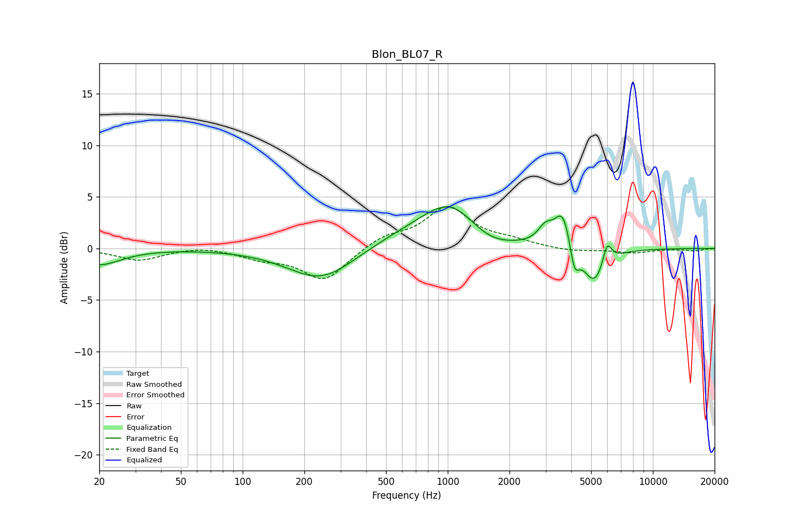

# Blon_BL07_R
See [usage instructions](https://github.com/jaakkopasanen/AutoEq#usage) for more options and info.

### Parametric EQs
Apply preamp of -4.1 dB when using parametric equalizer.

|   # | Type    |   Fc (Hz) |    Q |   Gain (dB) |
|-----|---------|-----------|------|-------------|
|   1 | Peaking |        20 | 1.34 |        -1.6 |
|   2 | Peaking |       242 | 0.87 |        -3.2 |
|   3 | Peaking |       640 | 0.69 |         1.2 |
|   4 | Peaking |      1035 | 1.04 |         3.8 |
|   5 | Peaking |      1581 | 1.33 |        -1.1 |
|   6 | Peaking |      2986 | 3.99 |         1.4 |
|   7 | Peaking |      3658 | 3.28 |         3.9 |
|   8 | Peaking |      4140 | 6    |        -2.9 |
|   9 | Peaking |      5196 | 2.37 |        -3.8 |
|  10 | Peaking |      5984 | 6    |         2.3 |

### Fixed Band EQs
When using fixed band (also called graphic) equalizer, apply preamp of **-4.2 dB** (if available) and set gains manually with these parameters.

|   # | Type    |   Fc (Hz) |    Q |   Gain (dB) |
|-----|---------|-----------|------|-------------|
|   1 | Peaking |        31 | 1.41 |        -1.1 |
|   2 | Peaking |        62 | 1.41 |         0.3 |
|   3 | Peaking |       125 | 1.41 |        -0.8 |
|   4 | Peaking |       250 | 1.41 |        -3.1 |
|   5 | Peaking |       500 | 1.41 |         1.1 |
|   6 | Peaking |      1000 | 1.41 |         3.9 |
|   7 | Peaking |      2000 | 1.41 |         0.6 |
|   8 | Peaking |      4000 | 1.41 |        -0.3 |
|   9 | Peaking |      8000 | 1.41 |        -0.4 |
|  10 | Peaking |     16000 | 1.41 |        -0.2 |

### Graphs

