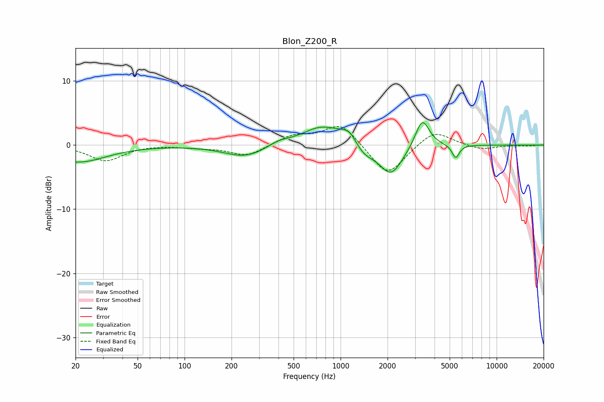

# Blon_Z200_R
See [usage instructions](https://github.com/jaakkopasanen/AutoEq#usage) for more options and info.

### Parametric EQs
Apply preamp of -3.6 dB when using parametric equalizer.

|   # | Type    |   Fc (Hz) |    Q |   Gain (dB) |
|-----|---------|-----------|------|-------------|
|   1 | Peaking |        21 | 0.8  |        -2.6 |
|   2 | Peaking |       246 | 1.04 |        -1.9 |
|   3 | Peaking |       401 | 2.09 |         0.7 |
|   4 | Peaking |       757 | 1.12 |         3   |
|   5 | Peaking |      1014 | 2.79 |         0.5 |
|   6 | Peaking |      1148 | 3.33 |         1.4 |
|   7 | Peaking |      1417 | 2.37 |        -1.4 |
|   8 | Peaking |      2103 | 1.84 |        -4.8 |
|   9 | Peaking |      3338 | 3.11 |         4.6 |
|  10 | Peaking |      5464 | 6    |        -2.1 |

### Fixed Band EQs
When using fixed band (also called graphic) equalizer, apply preamp of **-3.0 dB** (if available) and set gains manually with these parameters.

|   # | Type    |   Fc (Hz) |    Q |   Gain (dB) |
|-----|---------|-----------|------|-------------|
|   1 | Peaking |        31 | 1.41 |        -2.4 |
|   2 | Peaking |        62 | 1.41 |         0.1 |
|   3 | Peaking |       125 | 1.41 |        -0.3 |
|   4 | Peaking |       250 | 1.41 |        -1.7 |
|   5 | Peaking |       500 | 1.41 |         1.4 |
|   6 | Peaking |      1000 | 1.41 |         3.5 |
|   7 | Peaking |      2000 | 1.41 |        -5   |
|   8 | Peaking |      4000 | 1.41 |         2.5 |
|   9 | Peaking |      8000 | 1.41 |        -0.7 |
|  10 | Peaking |     16000 | 1.41 |        -0.1 |

### Graphs

