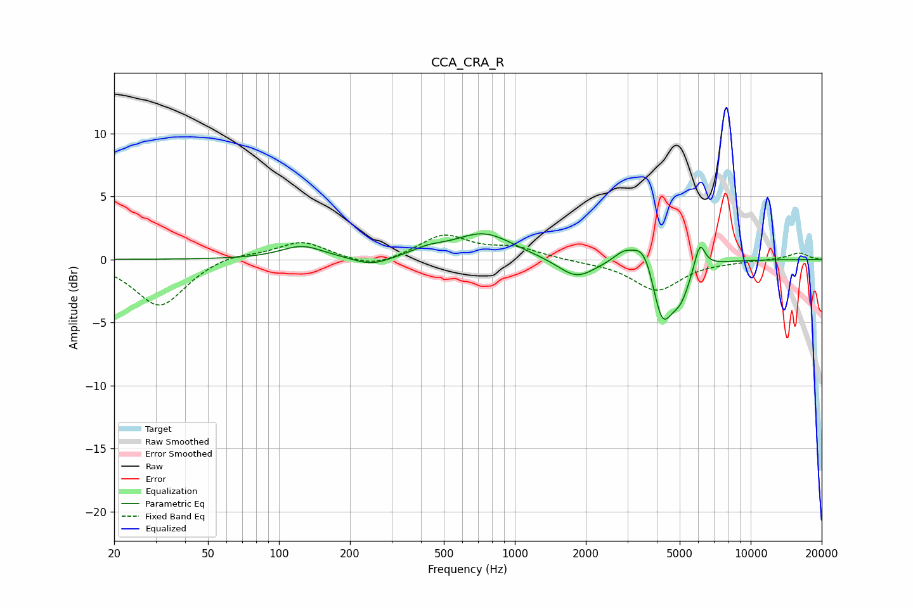

# CCA_CRA_R
See [usage instructions](https://github.com/jaakkopasanen/AutoEq#usage) for more options and info.

### Parametric EQs
Apply preamp of -2.1 dB when using parametric equalizer.

|   # | Type    |   Fc (Hz) |    Q |   Gain (dB) |
|-----|---------|-----------|------|-------------|
|   1 | Peaking |       125 | 1.55 |         1.1 |
|   2 | Peaking |       247 | 1.82 |        -0.7 |
|   3 | Peaking |       429 | 1.98 |         0.5 |
|   4 | Peaking |       739 | 1.12 |         2.1 |
|   5 | Peaking |      1826 | 1.79 |        -1.6 |
|   6 | Peaking |      2888 | 3.23 |         0.8 |
|   7 | Peaking |      3559 | 2.87 |         2.5 |
|   8 | Peaking |      4204 | 3.14 |        -5.1 |
|   9 | Peaking |      5045 | 3.31 |        -2.3 |
|  10 | Peaking |      6084 | 6    |         2.2 |

### Fixed Band EQs
When using fixed band (also called graphic) equalizer, apply preamp of **-2.0 dB** (if available) and set gains manually with these parameters.

|   # | Type    |   Fc (Hz) |    Q |   Gain (dB) |
|-----|---------|-----------|------|-------------|
|   1 | Peaking |        31 | 1.41 |        -3.8 |
|   2 | Peaking |        62 | 1.41 |         0.5 |
|   3 | Peaking |       125 | 1.41 |         1.4 |
|   4 | Peaking |       250 | 1.41 |        -0.8 |
|   5 | Peaking |       500 | 1.41 |         1.9 |
|   6 | Peaking |      1000 | 1.41 |         0.8 |
|   7 | Peaking |      2000 | 1.41 |        -0.1 |
|   8 | Peaking |      4000 | 1.41 |        -2.4 |
|   9 | Peaking |      8000 | 1.41 |        -0.1 |
|  10 | Peaking |     16000 | 1.41 |         0.5 |

### Graphs

