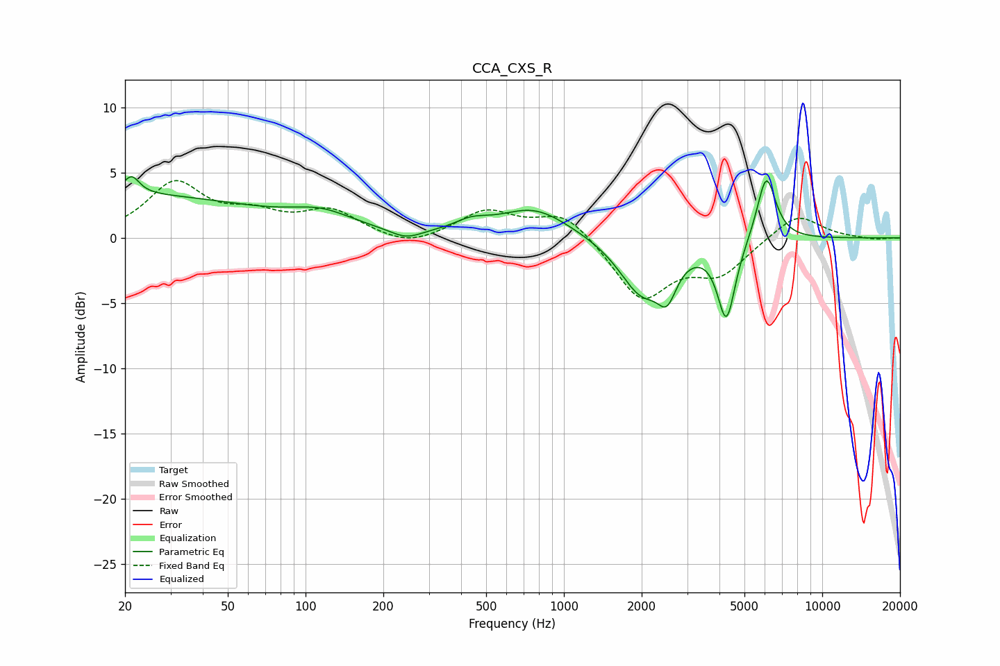

# CCA_CXS_R
See [usage instructions](https://github.com/jaakkopasanen/AutoEq#usage) for more options and info.

### Parametric EQs
Apply preamp of -4.8 dB when using parametric equalizer.

|   # | Type    |   Fc (Hz) |    Q |   Gain (dB) |
|-----|---------|-----------|------|-------------|
|   1 | Peaking |        20 | 0.26 |         3.3 |
|   2 | Peaking |        21 | 4.73 |         1.4 |
|   3 | Peaking |       116 | 1.17 |         1.2 |
|   4 | Peaking |       245 | 2.34 |        -0.7 |
|   5 | Peaking |       438 | 2.17 |         0.7 |
|   6 | Peaking |       767 | 1.03 |         2.3 |
|   7 | Peaking |      1997 | 1.62 |        -4.2 |
|   8 | Peaking |      2510 | 3.89 |        -2.6 |
|   9 | Peaking |      4258 | 4.05 |        -6   |
|  10 | Peaking |      6073 | 3.76 |         5.1 |

### Fixed Band EQs
When using fixed band (also called graphic) equalizer, apply preamp of **-4.5 dB** (if available) and set gains manually with these parameters.

|   # | Type    |   Fc (Hz) |    Q |   Gain (dB) |
|-----|---------|-----------|------|-------------|
|   1 | Peaking |        31 | 1.41 |         4.1 |
|   2 | Peaking |        62 | 1.41 |         1.4 |
|   3 | Peaking |       125 | 1.41 |         1.9 |
|   4 | Peaking |       250 | 1.41 |        -0.8 |
|   5 | Peaking |       500 | 1.41 |         2   |
|   6 | Peaking |      1000 | 1.41 |         2   |
|   7 | Peaking |      2000 | 1.41 |        -4.7 |
|   8 | Peaking |      4000 | 1.41 |        -2.5 |
|   9 | Peaking |      8000 | 1.41 |         2   |
|  10 | Peaking |     16000 | 1.41 |        -0.1 |

### Graphs

