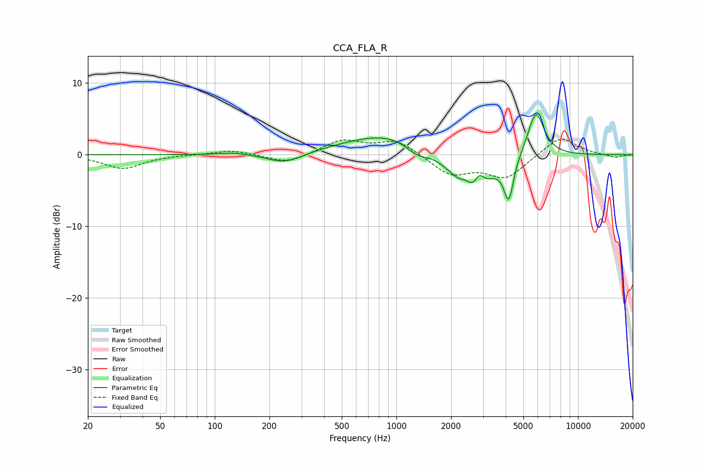

# CCA_FLA_R
See [usage instructions](https://github.com/jaakkopasanen/AutoEq#usage) for more options and info.

### Parametric EQs
Apply preamp of -5.7 dB when using parametric equalizer.

|   # | Type    |   Fc (Hz) |    Q |   Gain (dB) |
|-----|---------|-----------|------|-------------|
|   1 | Peaking |       128 | 1.87 |         0.3 |
|   2 | Peaking |       244 | 1.45 |        -1.5 |
|   3 | Peaking |       934 | 0.57 |         3.1 |
|   4 | Peaking |      1297 | 2.25 |        -1.5 |
|   5 | Peaking |      2409 | 4.54 |         1.3 |
|   6 | Peaking |      2575 | 1.38 |        -6.6 |
|   7 | Peaking |      2861 | 5.64 |         1.9 |
|   8 | Peaking |      4125 | 4.9  |        -2.6 |
|   9 | Peaking |      4172 | 5.99 |        -3   |
|  10 | Peaking |      5859 | 3.03 |         6.5 |

### Fixed Band EQs
When using fixed band (also called graphic) equalizer, apply preamp of **-2.2 dB** (if available) and set gains manually with these parameters.

|   # | Type    |   Fc (Hz) |    Q |   Gain (dB) |
|-----|---------|-----------|------|-------------|
|   1 | Peaking |        31 | 1.41 |        -1.9 |
|   2 | Peaking |        62 | 1.41 |         0   |
|   3 | Peaking |       125 | 1.41 |         0.7 |
|   4 | Peaking |       250 | 1.41 |        -1.3 |
|   5 | Peaking |       500 | 1.41 |         2   |
|   6 | Peaking |      1000 | 1.41 |         2   |
|   7 | Peaking |      2000 | 1.41 |        -2.7 |
|   8 | Peaking |      4000 | 1.41 |        -3.2 |
|   9 | Peaking |      8000 | 1.41 |         2.7 |
|  10 | Peaking |     16000 | 1.41 |        -0.4 |

### Graphs

